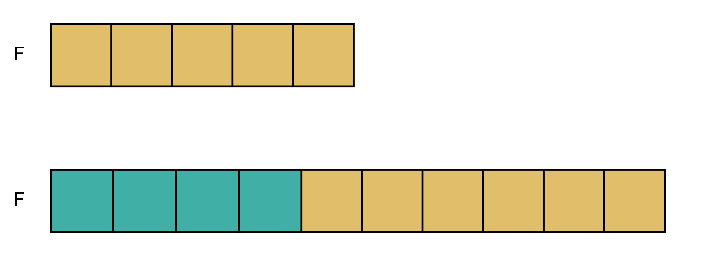
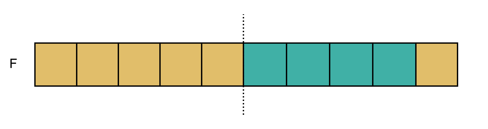
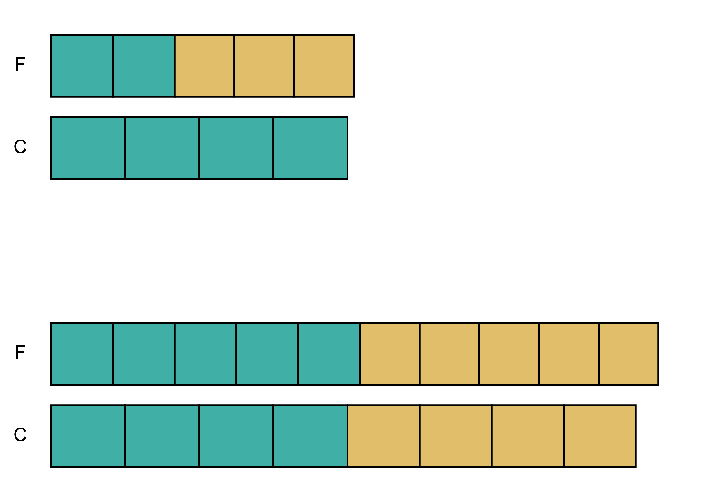
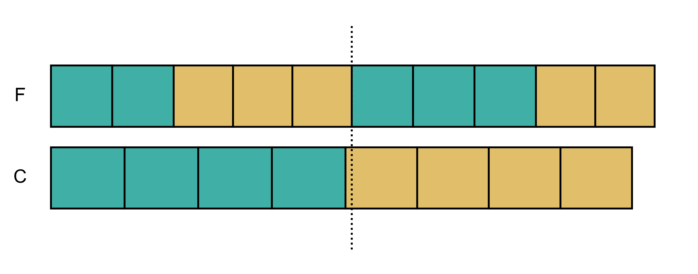

# `calendar-equations` Command

`calendar-equations` gives simple access to some of Heniautos' features for exploring [calendar equations](calendar-equations.md).

## Equations

Use the `-e` parameter to provide an equation in the format "month month-day prytany prytany-day." For example:

    > calendar_equation.py -e Pos 20 V 24

For the festival month, use a three letter abbreviation, one of "hek": "met", "boe", "pua", "mai", "pos", "gam", "ant", "ela", "mou", "tha", "ski". For the prytany use a Roman numeral. Capitalization does not matter.

The output will be a list of solutions (if there are any) and conditions that satisfy the equation:

    > calendar_equation.py -e Pos 20 V 24
    Pos 20 ( 6-) =    V 24 =  DOY 165 (O) [HHHHH, LSSS]
    Pos 20 ( 6-) =    V 24 =  DOY 166 (O) [FHHHH, LLSS]
    Pos 20 ( 6-) =    V 24 =  DOY 167 (O) [FFHHH, LLLS]
    Pos 20 ( 6-) =    V 24 =  DOY 168 (O) [FFFHH, LLLL]
    
The components of the output are:

* The festival date (`Pos 20`)
* The number of the month in the year (`6`) and whether or not an intercalation must precede it (`+`) or not (`-`)
* The prytany date (`V 24`)
* The day of the year (`DOY 165`)
* Whether the solution for an ordinary year (`O`) or intercalary (`I`)
* The count of lengths for preceding festival months (`FFFHH`) and prytanies (`LLLS`). This is a _count_ that implies nothing about the _order_
	* `F` and `H` always indicate "full" 30-day and "hollow" 29-day festival months
	* `L` and `S` indicate whatever the "long" and "short" prytanies are for the era and type of year of the equation. For instance `L` and `S` might mean 39- and 38- day prytanies in a 10-prytany intercalary year, or 30- and 29- day prytanies in a 12-prytany ordinary year. 

The output above means that Posideiṓn 20 = Prytany V 24 only if Posideiṓn is the sixth month, not preceded by an intercalation, and (redundantly) in an ordinary year. It would be DOY 165 if preceded by five hollow months, and one long and three short prytanies. It would be DOY 168 if preceded by three full and two hollow months, and four long prytanies, with two more possible solutions in-between.

### Maximum Month/Prytany Counts

`calendar-equations` excludes some impossible counts but not others. It will not generate solutions that exceed the total possible long or short months or prytanies, but may generate solutions with an unlikely number within that limit. In the above example, the DOY 165 solution is output even though five hollow months in a row is not possible because any year _can_ have five hollow months. With an equation for later in the year:

    > calendar_equation.py -e Ski 30 X 36
    Ski 30 (12-) =    X 36 =  DOY 354 (O) [FFFFFHHHHHH, LLLSSSSSS]
    Ski 30 (12-) =    X 36 =  DOY 355 (O) [FFFFFFHHHHH, LLLLSSSSS]
    
Neither solution has a number of full or hollow months greater the total number possible for the year.

### Number of Prytanies

By default, solutions are for ten prytany years. You can change this by providing a specific number of prytanies (10, 12, or 13) with the `-p` option, or by providing a year (which will be interpreted as BCE) with the `-y` option, from which the number of prytanies will be calculated.

### Limiting by Type of Year

To limit solutions to only those that require an ordinary or intercalary year, use `--ordinary` or `--intercalary`. You can also use `--no-ordinary` and `--no-intercalary` to exclude a type of year.

### Multiple Dates

You can provide multiple options for a festival or prytany day by separating them with slashes. For instance, in IG II³,1 347, the festival date needs restoration: 

    .... ὀγδοίη[ς πρυ]-
	[τανεί]ας...
    Ἐλαφηβολιῶν[ος ..]-
    [....] ἐπὶ δέκα, ἑβδόμει τ[ῆς π]-
    [ρυτα]νείας
    
τρίτηι, ὀγδόηι, and ἐνάτηι all fit the available space. You can examine all three options at once as `Ela 13/18/19`:

    > calendar_equation.py -e Ela 13/18/19 VIII 7
    Ela 18 ( 9-) = VIII  7 =  DOY 253 (O) [FFFHHHHH, LSSSSSS]
    Ela 19 ( 9-) = VIII  7 =  DOY 253 (O) [FFHHHHHH, LSSSSSS]
    Ela 18 ( 9-) = VIII  7 =  DOY 254 (O) [FFFFHHHH, LLSSSSS]
    Ela 19 ( 9-) = VIII  7 =  DOY 254 (O) [FFFHHHHH, LLSSSSS]
    Ela 18 ( 9-) = VIII  7 =  DOY 255 (O) [FFFFFHHH, LLLSSSS]
    Ela 19 ( 9-) = VIII  7 =  DOY 255 (O) [FFFFHHHH, LLLSSSS]
    Ela 18 ( 9-) = VIII  7 =  DOY 256 (O) [FFFFFFHH, LLLLSSS]
    Ela 19 ( 9-) = VIII  7 =  DOY 256 (O) [FFFFFHHH, LLLLSSS]
    Ela 13 (10+) = VIII  7 =  DOY 276 (I) [FFHHHHHHH, LLLSSSS]
    Ela 13 (10+) = VIII  7 =  DOY 277 (I) [FFFHHHHHH, LLLLSSS]
    
Since the last day of the month, ἕνη καὶ νέα, can always be the 29th or the 30th, you can simply use `last` rather than `29/30`

    > calendar_equation.py -e Ski last X 36
    Ski 29 (12-) =    X 36 =  DOY 354 (O) [FFFFFFHHHHH, LLLSSSSSS]
    Ski 30 (12-) =    X 36 =  DOY 354 (O) [FFFFFHHHHHH, LLLSSSSSS]
    Ski 29 (12-) =    X 36 =  DOY 355 (O) [FFFFFFFHHHH, LLLLSSSSS]
    Ski 30 (12-) =    X 36 =  DOY 355 (O) [FFFFFFHHHHH, LLLLSSSSS]
    Ski 29 (13+) =    X 36 =  DOY 382 (I) [FFFFFHHHHHHH, LLLLSSSSS]

You can use `any` for an unknown month, prytany or day, e.g.

    > calendar_equation.py -e any 19 VIII 7
    > calendar_equation.py -e Ela any VIII 7
    > calendar_equation.py -e Ela 19 any 7
    > calendar_equation.py -e Ela 19 VIII any
    
Or in combination, such as

    > calendar_equation.py -e any 19 VIII any

## Collations

Your can provide multiple equations at once simply by adding more with more `-e` options. `calendar-equations` will generate solutions for each in turn:

    > calendar_equation.py -e Pos 27/28 V 31 -e Tha 18 IX 29
    Pos 27 ( 6-) =    V 31 =  DOY 172 (O) [HHHHH, LSSS]
    Pos 27 ( 6-) =    V 31 =  DOY 173 (O) [FHHHH, LLSS]
    Pos 28 ( 6-) =    V 31 =  DOY 173 (O) [HHHHH, LLSS]
    Pos 27 ( 6-) =    V 31 =  DOY 174 (O) [FFHHH, LLLS]
    Pos 28 ( 6-) =    V 31 =  DOY 174 (O) [FHHHH, LLLS]
    Pos 27 ( 6-) =    V 31 =  DOY 175 (O) [FFFHH, LLLL]
    Pos 28 ( 6-) =    V 31 =  DOY 175 (O) [FFHHH, LLLL]
    Tha 18 (11-) =   IX 29 =  DOY 312 (O) [FFFFHHHHHH, LLLSSSSS]
    Tha 18 (11-) =   IX 29 =  DOY 313 (O) [FFFFFHHHHH, LLLLSSSS]
    
If you provide multiple equations with the additional `-c` or `--collate` option, `calendar-equations` will _collate_ the equations a generate information on how the equations fit together (if they do). For instance, the above equations collated:

    calendar_equation.py -e Pos 27/28 V 31 -e Tha 18 IX 29 -c
    Pos 27 ( 6-) =    V 31 =  DOY 172 (O) [HHHHH, LSSS]
    Pos 27 ( 6-) =    V 31 =  DOY 173 (O) [FHHHH, LLSS]
    Pos 28 ( 6-) =    V 31 =  DOY 173 (O) [HHHHH, LLSS]
    Pos 27 ( 6-) =    V 31 =  DOY 174 (O) [FFHHH, LLLS]
    Pos 28 ( 6-) =    V 31 =  DOY 174 (O) [FHHHH, LLLS]
    Pos 27 ( 6-) =    V 31 =  DOY 175 (O) [FFFHH, LLLL]
    Pos 28 ( 6-) =    V 31 =  DOY 175 (O) [FFHHH, LLLL]
    Tha 18 (11-) =   IX 29 =  DOY 312 (O) [FFFFHHHHHH, LLLSSSSS]
    Tha 18 (11-) =   IX 29 =  DOY 313 (O) [FFFFFHHHHH, LLLLSSSS]
      1: HHHHH FFFFH   LSSS LLSS
      2: HHHHH FFFFF   LSSS LLLS
      3: FHHHH FFFHH   LLSS LSSS
      4: FHHHH FFFFH   LLSS LLSS
      5: HHHHH FFFFH   LLSS LSSS
      6: HHHHH FFFFF   LLSS LLSS
      7: FFHHH FFHHH   LLLS SSSS
      8: FFHHH FFFHH   LLLS LSSS
      9: FHHHH FFFHH   LLLS SSSS
     10: FHHHH FFFFH   LLLS LSSS
     11: FFFHH FFHHH   LLLL SSSS
     12: FFHHH FFFHH   LLLL SSSS
      1: Pos 27 = V 31 = 172 + Tha 18 = IX 29 = 312
      2: Pos 27 = V 31 = 172 + Tha 18 = IX 29 = 313
      3: Pos 27 = V 31 = 173 + Tha 18 = IX 29 = 312
      4: Pos 27 = V 31 = 173 + Tha 18 = IX 29 = 313
      5: Pos 28 = V 31 = 173 + Tha 18 = IX 29 = 312
      6: Pos 28 = V 31 = 173 + Tha 18 = IX 29 = 313
      7: Pos 27 = V 31 = 174 + Tha 18 = IX 29 = 312
      8: Pos 27 = V 31 = 174 + Tha 18 = IX 29 = 313
      9: Pos 28 = V 31 = 174 + Tha 18 = IX 29 = 312
     10: Pos 28 = V 31 = 174 + Tha 18 = IX 29 = 313
     11: Pos 27 = V 31 = 175 + Tha 18 = IX 29 = 313
     12: Pos 28 = V 31 = 175 + Tha 18 = IX 29 = 313
     
There are three parts to the output:

1. The individual solutions. This is same as the output without the `-c` option
2. Partitions: How the lengths of months and prytanies must be arranged in segments of the year defined by each equation (more on this below)
3. The full equations, numbered in correspondence with the partitions. That is #1 `1: Pos 27 = V 31 = 172 + Tha 18 = IX 29 = 312` goes with partition #1 `1: HHHHH FFFFH   LSSS LLSS`

### Partitions

This is the most important part of what `calendar-equations` does. Each solutions to a single equation comes with a requirement for the count and lenghths of the months preceding the equation. If Pos 27/28 is the sixth month, then five months precede it and the solutions generated by `calendar-equations` range from one in which all five of the those months are hollow, to one in which three are full and two are hollow. Simarly, for prytany V 31, there are four preceding prytanies and range from one long to four long prytanies.

This is considered a solution:

    Pos 27 ( 6-) =    V 31 =  DOY 172 (O) [HHHHH, LSSS]
    
Because Pos 27 is the 172nd day of the year if preceded by five hollow months (29 × 5 + 27 = 172) and V 31 is the 172nd day of the year if preceded by one long (36-day in an ordinary year) and three short (35-day) prytanies (36 × 1 + 35 × 3 = 172). The festival and conciliar conditions coincide to give us a solution to the equation. If you are noticing that there cannot be five hollow months in a row, see above on "Maximum Month/Prytany Counts"

We also have this equation and solution for the same year:

    Tha 18 (11-) =   IX 29 =  DOY 312 (O) [FFFFHHHHHH, LLLSSSSS]
    
This solution requires that six ten months must be full, six hollow. If we take the two together we have one that requires that five of those hollow months must come in the first five months:

Combined, we can say that for both these equations to be true, there must be five hollow months followed by four full and one hollow:

These are the "partitions" of the festival year: `HHHHH FFFFH`, In the diagram above the partitions are divided by the dotted line. This is true of the conciliar year as well. For this let's look at a more realistic example. The last solution:

    Pos 28 = V 31 = 175 + Tha 18 = IX 29 = 313
    
Has the partitions `FFHHH FFFHH   LLLL SSSS`. Separately, first festival solution requires two full and three hollow months, the second five full and five hollow. FOr the conciliar year the first solution requires four long prytanies, the second four long and four short
 

If we "subtract" the first solution from the second we are left with three full and two hollow months, and four short prytanies for the second partition:

Within the partitions, it is the count that matters and not the order. The two full and three hollow months of the first partition can be reordered (within this five month partition) to match aother lines of evidence.
