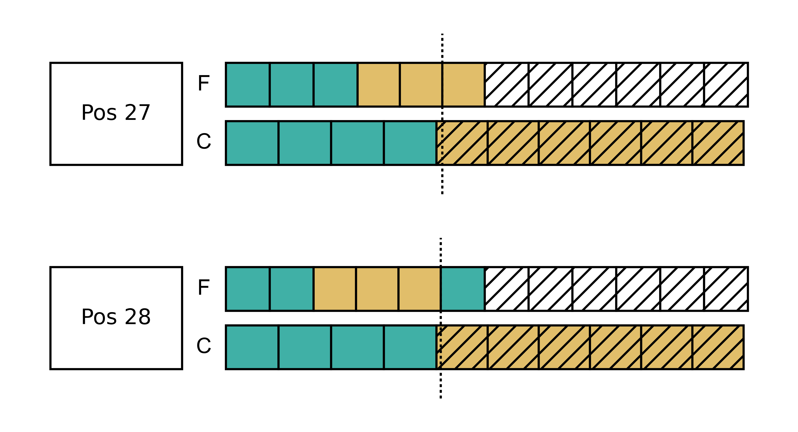
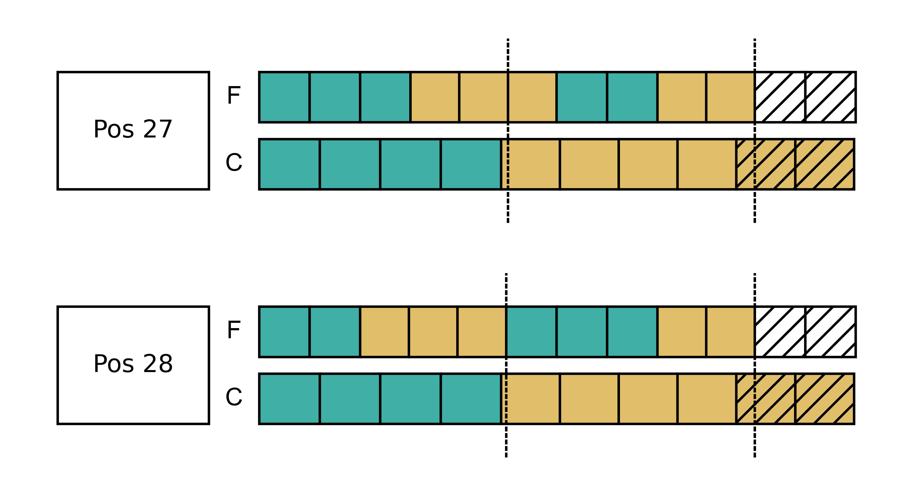
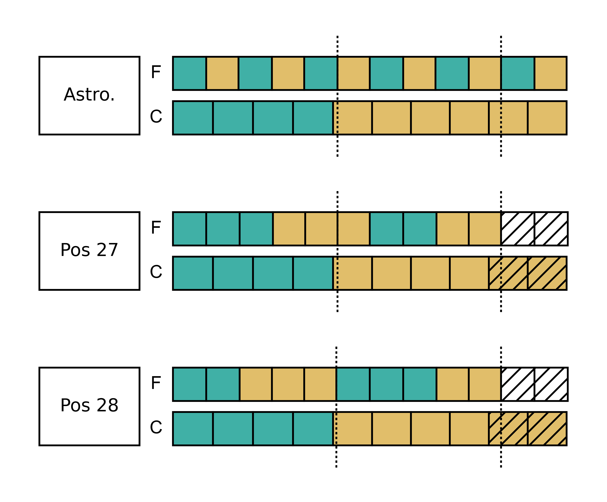
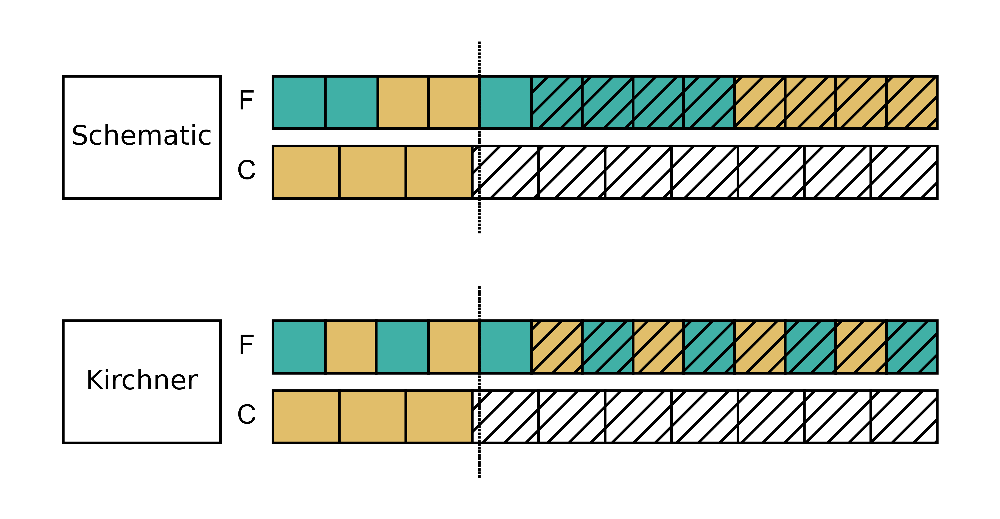
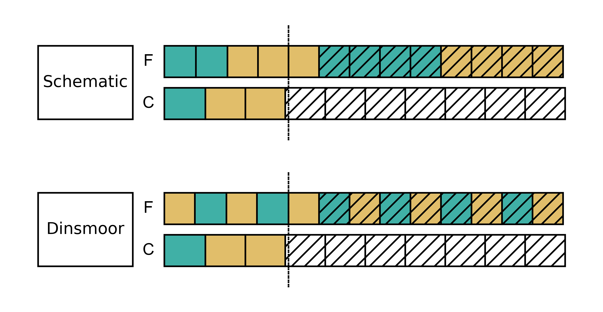
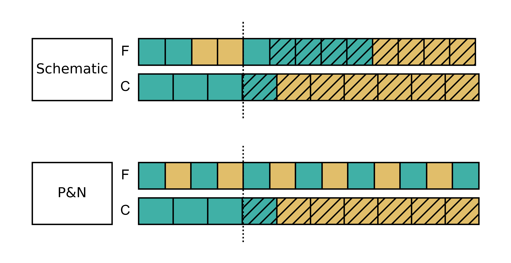
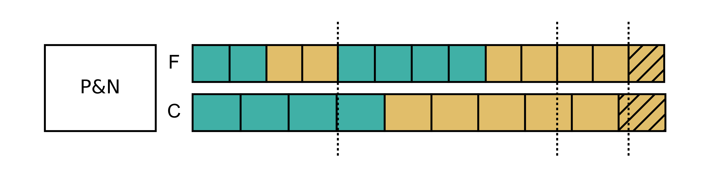
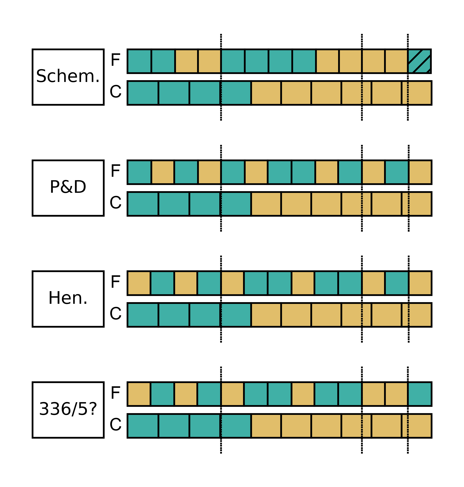
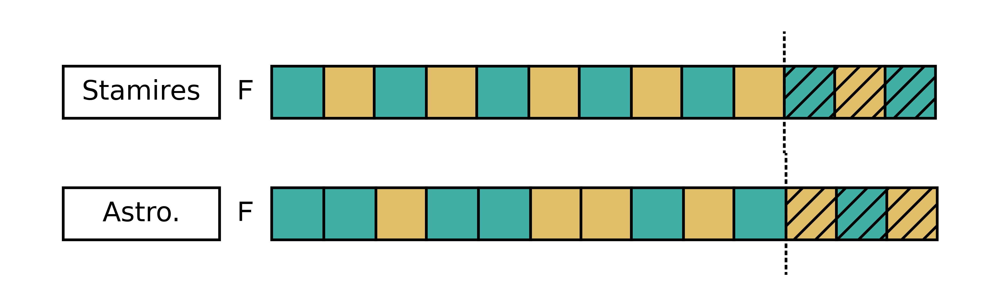
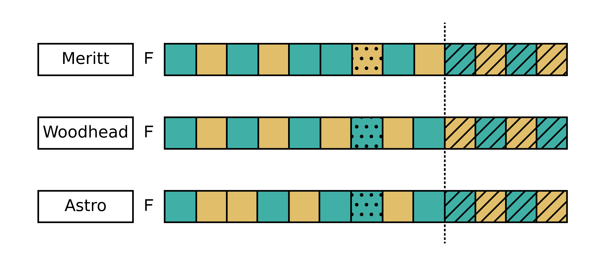

# Calendar Equations

This guide has included many caveats about the accuracy of `heniautos` and noted two documented intercalary years that `heniautos` gets wrong. On the other hand, what might `heniautos` get right, and how could we know? Welcome to the fascinating world of "calendar equations." These bits of evidence from the historical record allow us to test different theories of how the Athenians really used their calendar, and some cases, give confidence to reconstructions.

## What are Calendar Equations?

The term calendar equation refers to any evidence that relates one calendar to another. In Greek Epigraphy it commonly refers to inscriptions that relate the Athenian festival calendar and conciliar calendar. 

[A previous section](conciliar-calendar.md#the-start-of-4332) looked at an inscription that implied the calendar equations **Hek 18 = I 13** and **Met 12 = I 37**, but there are many inscriptions with _explicit_ calendar equations. In the latter part of the fourth century BCE, Athenians started "double dating" their decrees with a prytany date and a festival (the first surviving instance is from 346/5, [IG XII,6 1,261](http://telota.bbaw.de/ig/digitale-edition/inschrift/IG%20XII%206,%201,%20261) from the Athenian colony on Samos). Often these inscriptions are fragmentary and require knowledge of the calendar to restore, which is why so much of the initial investigations of the Athenian calendar in the 20th century were done by epigraphers, Like Benjamin D. Meritt and W. Kendrick Pritchett. There is also the risk of circular reasoning since assumptions about the calendar go into the restoration of the inscriptions which then, if you are not careful, might be used to "prove" what they assume (see Pritchett [1970] for Pritchett's criticisms of Meritt on this point)

There are, however, perfectly presevered examples, that we can begin with, such as  [IG II³ 1,338](http://telota.bbaw.de/ig/digitale-edition/inschrift/IG%20II_III%C2%B3%201,%20338) (=IG II² 338). This has a completely standard prescript with no restorations needed:

    ἐπὶ Νικοκράτους ἄρχοντος, ἐπὶ τῆς Αἰγηίδος
    πρώτης πρυτανείας, ἧι Ἀρχέλας Χαιρίου Παλ–
    ληνεὺς ἐγραμμάτευεν· Μεταγειτνιῶνος ἐνά–
    τηι ἱσταμένου· ἐνάτηι καὶ τριακοστῆι τῆς
    πρυτανείας

The parts of this prescript are:

1. The árkhōn: ἐπὶ Νικοκράτους ἄρχοντος, "in the árkhōnship of Nikokrátēs..." 333/2 BCE.
1. The prytany and tribe that held it: ἐπὶ τῆς Αἰγηίδος πρώτης πρυτανείας, "...in the first prytany, of Aigēis..."
1. The secretary: ἧι Ἀρχέλας Χαιρίου Παλληνεὺς ἐγραμμάτευεν, "...for which Arkhélas son of Khairías from Pallēnē was secretary..."
1. The festival date: Μεταγειτνιῶνος ἐνάτηι ἱσταμένου, "...9th of Metageitniṓn..."
1. The prytany day: ἐνάτηι καὶ τριακοστῆι τῆς πρυτανείας, "...39th of the prytany"

For a good introduction to these types of inscriptions, see Rhodes and Osborne (2003) xiii-xxiii. The two dates in the inscription provide a calendar equation:

**Metageitniṓn 9 = Prytany I 39**

or, for short:

**Met 9 = I 39**

In some cases, the equation provides useful data about the calendar for the year, or the calendar in general. For instance, this inscription tells us three things:

1. The year (333/332 BCE, which we know from the árkhōn) was intercalary because this prytany (the first) has 39 days. In [this period](conciliar-calendar.md#409-308-bce) the longest prytanies in ordinary years were 36 days.
1. Hekatombaiṓn was full. If the 39th day of the prytany is Metageitniṓn 9, the 31st would be Metageitniṓn 1, and therefore the 30th has to be Hekatombaiṓn 30.
1. The intercalated month was not Hekatombaiṓn because having a second Hekatombaiṓn before Metageitniṓn would push Metageitniṓn into the second prytany. This is hardly surprising, but it is worth keeping in mind.

I 39 is the 39th day of the year, as is Metageitniṓn 9 if Hekatombaiṓn is full (30 + 9 = 39). The "solution" to this equation, then, is

**Met 9 = I 39 = DOY 39**

"Solving" the equation means being able to assign it, with some confidence, to a specific day of the year. When we have a solution we are often able to limit the range of possibilities for other aspects of the calendar for the same year. For instance, we can say that 333/2 was intercalary, not ordinary, and that Hekatombaiṓn was full, not hollow.

What does `heniautos` calculate for this year?

    > heniautos -m 333
         Year     |        Month          |      Start      | Days
    --------------|-----------------------|-----------------|-----
    BCE 333/332   | Hekatombaiṓn          | BCE 0333-Jul-03 |   29
    BCE 333/332   | Metageitniṓn          | BCE 0333-Aug-01 |   30
    BCE 333/332   | Boēdromiṓn            | BCE 0333-Aug-31 |   29
    BCE 333/332   | Puanopsiṓn            | BCE 0333-Sep-29 |   30
    BCE 333/332   | Maimaktēriṓn          | BCE 0333-Oct-29 |   29
    BCE 333/332   | Posideiṓn             | BCE 0333-Nov-27 |   30
    BCE 333/332   | Posideiṓn hústeros    | BCE 0333-Dec-27 |   29
    BCE 333/332   | Gamēliṓn              | BCE 0332-Jan-25 |   30
    BCE 333/332   | Anthestēriṓn          | BCE 0332-Feb-24 |   29
    BCE 333/332   | Elaphēboliṓn          | BCE 0332-Mar-25 |   30
    BCE 333/332   | Mounuchiṓn            | BCE 0332-Apr-24 |   29
    BCE 333/332   | Thargēliṓn            | BCE 0332-May-23 |   30
    BCE 333/332   | Skirophoriṓn          | BCE 0332-Jun-22 |   29

It correctly calculates 333/2 as an intercalary year but, based on the astronomy, makes Hekatombaiṓn hollow. Since Metageitniṓn calculated as full we can "fix" this by simply moving the start date of Metageitniṓn so that Hekatombaiṓn is full instead. 

         Year     |        Month          |      Start      | Days
    --------------|-----------------------|-----------------|-----
    BCE 333/332   | Hekatombaiṓn          | BCE 0333-Jul-03 |   30
    BCE 333/332   | Metageitniṓn          | BCE 0333-Aug-02 |   29
    ...

This does not disturb the rest of the calculated calendar and means we can be slightly more accurate about dates in Hekatombaiṓn and Metageitniṓn. For the rest of the year, we have no better evidence than astronomy. The important point, as before, is that if you need historical accuracy the calculations made by Heniautos are a framework for examining other evidence. If you need an approximate date Heniautos (and just about any other reconstruction) are close enough/

We can provisionally put a Julian date to our equation. Since we know the day of the year, we can look it up with the `--doy` option:

    heniautos 333 --doy 39
         Year     |        Month          | Day |      Start      | DOY
    --------------|-----------------------|-----|-----------------|----
    BCE 333/332   | Metageitniṓn          |  10 | BCE 0333-Aug-10 |  39
    
(It is Metageitniṓn 10 because Heniautos is working with a hollow Metageitniṓn, so remember that we moved Metageitniṓn 1 to August 2 and know from the evidence of the inscription that this day is actually Metageitniṓn 9)
    
**Met 9 = I 39 = DOY 39 = ✸Aug 10, 333 BCE**

I am going to use the star symbol ✸ to mark anything that comes from an astronomical calculation and therefore has a margin of error as long as we are not certain how the beginnings of months were observed or calculated. Using `-r 0` or `-r 1` as the "visibility rule" will shift the date to Aug 8 or 9 respectively.

## `calendar-equations`

Along with the `heniautos` command, Heniautos, installs a second command, `calendar-equation` for working with these equations.

    > calendar_equation.py -y 333 -e Met 9 I 39
    Met  9 ( 2-) =    I 39 =  DOY  39 (I) [F, ∅]
    
`calendar-equation` take a year (`-y`) and an equation (`-e`) in the format "month-abbreviation day prytany-number day." The prytany number needs to be a Roman numeral but it does not matter if it or the month abbreviation is capitalized.

The output is rather terse, but you can see that it contains the basic calendar equation. The `( 2-)` after `Met  9` means that Metageitniṓn is the second month (`2`) and is _not_ preceded by an intercalation (`-`). If it were preceded by an intercalation, this would be `( 3+)`. The `(I)` after `DOY  39` indicates that this solution requires an intercalary year; `(O)` would mean it was an ordinary year. `[F, ∅]` indicates the count of festival months and prytanies that must precede this solution--one full month `F`, and no prytanies, `∅` (that is, "null") since this is the first prytany. Hopefully this will become clear with more examples. This solution from `calendar-equation` contains all the facts that we worked out ourselves for this simple equation, and the fact that it only output a single solution indicates that it is the _only_ solution for this equation.

We will use `calendar-equation` for examples in the rest this guide. 

### Multiple Equations

Agora XVI 91 

    [ἐπὶ Ἡγησίου ἄρχοντος, ἐπ]ὶ τῆς Α-
    [ἰαντίδος πέμπτης πρυτα]νείας
    [ἧι Εὐφάνης Φρύνωνος Ῥαμ]ν̣ούσι-
    [ος ἐγραμμάτευεν· Ποσιδε]ῶνος v
    [τρίτηι μετ’ εἰκάδας, μιᾶι κ]αὶ τρ-
    [ιακοστῆι τῆς πρυτανείας

The date τρίτηι μετ’ εἰκάδας is a "backward count" an essentially means "third from the end". In full month, this will be the 28th, in a hollow the 27th. We can give the date to `calendar-equation` in the format `Pos 27/28` to test both.

    > calendar_equation.py -p 10    -e Pos 27/28 V 31
    Pos 27 ( 6-) =    V 31 =  DOY 172 (O) [HHHHH, LSSS]
    Pos 27 ( 6-) =    V 31 =  DOY 173 (O) [FHHHH, LLSS]
    Pos 28 ( 6-) =    V 31 =  DOY 173 (O) [HHHHH, LLSS]
    Pos 27 ( 6-) =    V 31 =  DOY 174 (O) [FFHHH, LLLS]
    Pos 28 ( 6-) =    V 31 =  DOY 174 (O) [FHHHH, LLLS]
    Pos 27 ( 6-) =    V 31 =  DOY 175 (O) [FFFHH, LLLL]
    Pos 28 ( 6-) =    V 31 =  DOY 175 (O) [FFHHH, LLLL]
    
 No we have multiple solutions but all of them require an ordinary year, which is what `heniautos` calculates:
 
    > heniautos 324 -y
         Year     | Y |      Start      | Days
    --------------|---|-----------------|-----
    BCE 324/323   | O | BCE 0324-Jul-23 |  354
    
`calendar-equations` will output solutions that are mathematically possible but astronomically unlikely or impossible. We can exclude the first and third solutions simply on the grounds that they require all five months before Posideiṓn to be hollow which would never happen.  The second solution requires four hollow months (FHHHH) but _not_ in a row. It is important to remember that this represents a _count_ of four hollow months and the actual _order_ could be two hollow, full, two hollow (that is `HHFHH`) with the same count.

For the prytany counts the order may be important. If we want to observe the Rule of Aristotle, we need the conciliar year to begin with four "long" prytanies. Since there are only four prytanies preceding this equation they must _all_ be long (or the Rule of Aristotle must not be a rule). Two of the solutions satisfy the rule one implying a hollow Posideiṓn (Pos 27 = V 31 = DOY 175) one a full Posideiṓn (Pos 28 = V 31 = DOY 175). We can show the count requirements graphically

The dotted lines represent the "horizon" of the equation--the solutions give us a count of full and hollow months for the first five months, to the left of the line. Since first solution requires a hollow month and second a full we can fill in this month to the right of the line. We cannot say anything yet about the rest of the festival months so they are empty.  Since the first four prytanies are long, we know the remaining six _must_ be short. We can color them accordingly but leave them with the diagonal hash marks to indicate that they are still hypothetical.

[IG II³,1 372](http://telota.bbaw.de/ig/digitale-edition/inschrift/IG%20II_III%C2%B3%201,%20372) (Meritt 1961, 105)
	
    [ἐ]φ’ Ἡγησίου ἄρχ[οντος, ἐπὶ τῆς Ἀκαμα]-
    [ν]τ̣ίδος ἐνάτης [πρυτανείας, ἧι Εὐφά]-
    [νη]ς Φρύνωνος Ῥ[αμνούσιος ἐγραμμά]-
    [τ]ευε· Θαργηλι̣[ῶνος ὀγδόηι ἐπὶ δέκα]·
    [ἐ]νάτει καὶ ε[ἰκοστῆι τῆς πρυτανεία]-
    [ς] 
    
IG II³ leaves the festival date unrestored, but we will accept Meritt's ὀγδόηι ἐπὶ δέκα.

    > calendar_equation.py -p 10    -e Tha 18 IX 29
    Tha 18 (11-) =   IX 29 =  DOY 312 (O) [FFFFHHHHHH, LLLSSSSS]
    Tha 18 (11-) =   IX 29 =  DOY 313 (O) [FFFFFHHHHH, LLLLSSSS]

Both solution require an ordinary year, so they are consistent with the Agora XVI 91 solutions. Only the second satisfies the Rule of Aristotle so lets focus on that one for simplicity. If we want to combine the solutions for the two equations we have to look for a way that combines them so that the second solution "contains" the first solution.

The two solutions for Agora XVI 91 that satisfied the Rule of Aristotle required the festival month counts `FFFHH` or `FFHHH`. We first "subtract" `FFFHH` from `FFFFFHHHHH` (the count required by IG II³,1 372)--that is, take three full and two hollow months out and see what the "remainder" is: `FFFFFHHHHH` - `FFFHH` = `FFHHH`. Put another way, `FFFHHFFFHH` is a rearrangement of the IG II³,1 372 solution that also satisfies the Agora XVI 91 solution.

`calendar-equation` can help with this. You can provide multiple equations with multiple `-e` options.

    > calendar_equation.py -p 10 -e Pos 27/28 V 31 -e Tha 18 IX 29
    Pos 27 ( 6-) =    V 31 =  DOY 172 (O) [HHHHH, LSSS]
    Pos 27 ( 6-) =    V 31 =  DOY 173 (O) [FHHHH, LLSS]
    Pos 28 ( 6-) =    V 31 =  DOY 173 (O) [HHHHH, LLSS]
    Pos 27 ( 6-) =    V 31 =  DOY 174 (O) [FFHHH, LLLS]
    Pos 28 ( 6-) =    V 31 =  DOY 174 (O) [FHHHH, LLLS]
    Pos 27 ( 6-) =    V 31 =  DOY 175 (O) [FFFHH, LLLL]
    Pos 28 ( 6-) =    V 31 =  DOY 175 (O) [FFHHH, LLLL]
    Tha 18 (11-) =   IX 29 =  DOY 312 (O) [FFFFHHHHHH, LLLSSSSS]
    Tha 18 (11-) =   IX 29 =  DOY 313 (O) [FFFFFHHHHH, LLLLSSSS]

This will simply output solutions for each equation in turn. If you add `-c` or `--collate` to command though, it will generate all the possible "collations" of the two equations together:

    > calendar_equation.py -p 10 -e Pos 27/28 V 31 -e Tha 18 IX 29 -c
      1: HHHHH FFFFH   LSSS LLSS
      2: HHHHH FFFFF   LSSS LLLS
      3: FHHHH FFFHH   LLSS LSSS
      4: FHHHH FFFFH   LLSS LLSS
      5: HHHHH FFFFH   LLSS LSSS
      6: HHHHH FFFFF   LLSS LLSS
      7: FFHHH FFHHH   LLLS SSSS
      8: FFHHH FFFHH   LLLS LSSS
      9: FHHHH FFFHH   LLLS SSSS
     10: FHHHH FFFFH   LLLS LSSS
     11: FFFHH FFHHH   LLLL SSSS
     12: FFHHH FFFHH   LLLL SSSS
      1: Pos 27 = V 31 = 172 + Tha 18 = IX 29 = 312
      2: Pos 27 = V 31 = 172 + Tha 18 = IX 29 = 313
      3: Pos 27 = V 31 = 173 + Tha 18 = IX 29 = 312
      4: Pos 27 = V 31 = 173 + Tha 18 = IX 29 = 313
      5: Pos 28 = V 31 = 173 + Tha 18 = IX 29 = 312
      6: Pos 28 = V 31 = 173 + Tha 18 = IX 29 = 313
      7: Pos 27 = V 31 = 174 + Tha 18 = IX 29 = 312
      8: Pos 27 = V 31 = 174 + Tha 18 = IX 29 = 313
      9: Pos 28 = V 31 = 174 + Tha 18 = IX 29 = 312
     10: Pos 28 = V 31 = 174 + Tha 18 = IX 29 = 313
     11: Pos 27 = V 31 = 175 + Tha 18 = IX 29 = 313
     12: Pos 28 = V 31 = 175 + Tha 18 = IX 29 = 313
     
This output could surely be improved, but it shows first the required counts and second the corresponding solutions. The eleventh is the pattern we calculated above and the spacing `FFFHH FFHHH` is to make it easier to distinguish the two "partitions": the five months required by Agora XVI 91 from the five further required by IG II³,1 372 (the "remainder" of "subtracting" the first from the second). Only two collated solutions satisfy the Rule of Aristotle. The first solution only requires two full and three hollow in the second "partition", but since we also know that the interpretation of τρίτηι μετ’ εἰκάδας as Pos 27 requires a hollow Posideiṓn, these months are arranged to show this:

Both solutions require that prytany V 31 is DOY 175 and IX 29 DOY 313. The difference is only whether there are three full months in the first five or two, and two in the next five or three. What is the astronomical prediction? 324/3 turns out to have perfectly alternating full and hollow months:

    > heniautos 324 -m
         Year     |        Month          |      Start      | Days
    --------------|-----------------------|-----------------|-----
    BCE 324/323   | Hekatombaiṓn          | BCE 0324-Jul-23 |   30
    BCE 324/323   | Metageitniṓn          | BCE 0324-Aug-22 |   29
    BCE 324/323   | Boēdromiṓn            | BCE 0324-Sep-20 |   30
    BCE 324/323   | Puanopsiṓn            | BCE 0324-Oct-20 |   29
    BCE 324/323   | Maimaktēriṓn          | BCE 0324-Nov-18 |   30
    BCE 324/323   | Posideiṓn             | BCE 0324-Dec-18 |   29
    BCE 324/323   | Gamēliṓn              | BCE 0323-Jan-16 |   30
    BCE 324/323   | Anthestēriṓn          | BCE 0323-Feb-15 |   29
    BCE 324/323   | Elaphēboliṓn          | BCE 0323-Mar-16 |   30
    BCE 324/323   | Mounuchiṓn            | BCE 0323-Apr-15 |   29
    BCE 324/323   | Thargēliṓn            | BCE 0323-May-14 |   30
    BCE 324/323   | Skirophoriṓn          | BCE 0323-Jun-13 |   29
    
In order to fit with the astronomical data, a solution to these two equations must have three full and two hollow months before Posideiṓn, Posideiṓn must be hollow, and two more full and two more hollow months must precede Thargēliṓn. This is exactly the Pos 27 solution. The counts in the calendar equation solutions, independent of their order, match the counts derived from the order calculated astronomically:

Note that of the twelve "collated" solutions, this is the _only_ solution that fits the astronomical data. None of the others call for three full months in the first five. While we used the Rule of Aristotle simply to reduce the number of possibilities for the purposes of illustration, in the end we got as the part of the unique solution. We can now state the complete solutions to the two calendar equations:

**Pos 27 = V 31 = DOY 175 = ✸Jan 13, 323 BCE**

**Tha 18 = IX 29 = DOY 313 = ✸May 31, 323 BCE**

## 336/5 BCE

Meritt's interpretation of the evidence for this year (Meritt 1961, 10-15) was briefly discussed under the Rule of Aristotle. We can now examine it in more detail. There are two inscriptions recording dated decrees for 336/5 BCE: IG II² 328 (=IG II² 328) and IG II³,1 327 (=IG II² 330) with two decrees on separate dates.

IG II³,1 329 (Meritt's IG II² 328) is very conservative:

    [․․․․․․․․․․20․․․․․․․․․․ ἐπ]ὶ τῆς Α[․]
    [․․․․․․․․17․․․․․․․․․ πρυτ]ανείας, ἧ-
    [ι ․․․․․․․․․19․․․․․․․․․․ ἐ]γραμμάτ-
    [ευεν· ․․․․․․․14․․․․․․․ τετ]ράδι φθί-
    [νοντος· ․․․․․․․15․․․․․․․․]ει τῆς πρ-
    [υτανείας]
    
This inscription has a "rich" history of restorations, but let us at least accept the restoration of Pythodelos as the archon (IG II² 328) in line one. 

    [ἐπὶ Πυθοδήλου ἄρχοντος ἐπ]ὶ τῆς Ἀ[.]-

It is interesting to follow some of the process by which successive generations of scholars worked through the problems posed by these texts. Kirchner, in IG II², specified **Mai 27 = IV 31**, restoring the following for lines 2-6.  

    [......... τετάρτης πρυτ]ανείας ἧ-
    [ι ․․․․․․․․19․․․․․․․․․ ἐ]γραμμάτ-
    [ευεν· Μαιμακτηριῶνος τετ]ράδι φθί-
    [νοντος, μιᾶι καὶ τριακοστ]εῖ τῆς πρ-
    [υτανείας

The interpretion of τετράδι φθίνοντος as the 27th shows that Kirchner assumed Maimaktēriṓn was full (since it would be the 26th of a hollow month). The equation of Mai 27 with IV 31, and the restoration of μιᾶι καὶ τριακοστεῖ for the prytany day rest on the assumption of alternating full and hollow months and years that mostly begin with a full Hekatombaiṓn. Thus Mai 27 = DOY 145 (30 + 29 + 30 + 29 + 27). To make the equation work, the first three pytanies must be 38 days long (38 + 38 + 38 + 31 = 145)

Translated into Heniautos terms, Kirchner's solution for this equation is the only one that accommodates this alternation (by virtue of having an even number of full and hollow months).

    > calendar_equation.py -e Mai 27 IV 31
    Mai 27 ( 5-) =   IV 31 =  DOY 145 (I) [FFHH, SSS]
    Mai 27 ( 5-) =   IV 31 =  DOY 146 (I) [FFFH, LSS]
    Mai 27 ( 5-) =   IV 31 =  DOY 147 (I) [FFFF, LLS]

Therefore, his **[Mai] 27 = [IV] [31]** looks like this:

Dinsmoor looked at this inscription next (Dinsmoor 1931, 356). He noted that all festival dates in IG II² 328 and 330 require restoring, but "In the first instance [IG II² 328] it was clearly the longest name Maimakterion so that the day must have been 144/145th of the year." He thus reopens the possibility of a hollow Maimaktēriṓn in which τετράδι φθίνοντος means the 26th. He then pursues this, again with the assumption of regularly alternating months: "Beginning the year with Hekatombaion and Maimakterion also being hollow it is probably that the first equation was Maim. 26 = Pryt. IV,29." That is, reading lines 4-5 as:

           [Μαιμακτηριῶνος τετ]ράδι φθί-
    [νοντος, ἐνάτηι καὶ εἰκοστ]εῖ

Plugging **Mai 26 = IV 29** into `calendar-equation` we have:

    > calendar_equation.py -e Mai 26 IV 29
    Mai 26 ( 5-) =   IV 29 =  DOY 143 (I) [FHHH, SSS]
    Mai 26 ( 5-) =   IV 29 =  DOY 144 (I) [FFHH, LSS]
    Mai 26 ( 5-) =   IV 29 =  DOY 145 (I) [FFFH, LLS]
    Mai 26 ( 5-) =   IV 29 =  DOY 146 (I) [FFFF, LLL]

Like Kirchner, Dinsmoor settled on the only solution (DOY 144) that worked with alternating full and hollow months (albeit the reverse alternation from Kirchner's), including the fact that "Pryt. I had 39 days, II-III had 38."

Pritchett and Neugebaur were the first to take Aristotle's statment about prytanies to heart. They disagreed with the previous practice of making restorations "in conformity with this assumption of rigid [sic] sequence of months and days in the civic calendar" since this led to "prytanies of varying lengths" being "interspersed at random thoughout the prytany year." Instead, they proposed that we "reverse the method by positing a rule of regularity in the length and sequence of prytanies" (Pritchett and Neugebauer 1947, 34-35). They thus restored the prytany date of IG II² 328 as the 28th (Pritchett and Neugebauer 1947, 43):

           [Μαιμακτηριῶνος τετ]ράδι φθί-
    [νοντος, ὀγδόηι καὶ εἰκοστ]εῖ
    
Returning to a full Maimaktēriṓn, this gives us an equation **Mai 27 = IV 28** 

    > calendar_equation.py -e Mai 27 IV 28
    Mai 27 ( 5-) =   IV 28 =  DOY 143 (I) [HHHH, LSS]
    Mai 27 ( 5-) =   IV 28 =  DOY 144 (I) [FHHH, LLS]
    Mai 27 ( 5-) =   IV 28 =  DOY 145 (I) [FFHH, LLL]

The DOY 145 solution allows for the Rule of Aristotle.

This clearly also still accomodates a regular alternation, but it does not assume it. The difference between Pritchet and Neugebauer's equation and Dinsmoor is that Dinsmoor, beginning with an assumption about the festival year settled on a solution that would only accomodate the Rule of Aristotle if the first four months were full (the DOY 146 solution for Mai 26 = IV 29, above, and astronomically improbable if not impossible). Pritchett and Neugebauer, on the other, begin with an assumption about the conciliar calendar and arrive at a solution that allows for regularity in the prytanies (the Rule) without excluding regularity in the festival months. 

IG II³,1 327 (= IG II² 330) contains two dates, one in lines 29-30:

    [ἐπ]ὶ Πυθοδήλου ἄρχοντος, ἐ[πὶ τῆς ․․․․8․․․․ ἐνάτης πρυτανεί]-
    [ας]· τετράδι ἐπὶ δέκα· δευτέ[ραι τῆς πρυτανείας
    
and another in lines 47-49:

    [ἐπ]ὶ Πυθοδήλου ἄρχοντος, ἐπ[ὶ τῆς ․․․․․10․․․․․ δεκάτης πρυτα]-
    [ν]είας· ἕνει καὶ νέαι· ἑβδόμη[ι καὶ τριακοστῆι τῆς πρυτανεία]-
    [ς]

The festival month is omitted in both, and since the prytany must be restored much relies on one's theories about the calendar. Kirchner was very much in the early days of calendar research and reconstructed of the lengths of the prytanies for this year (given in his commentary on IG II² 330) as 39, 38, 38, 38, 38, 38, 39, 39, 40, 37 days. Dinsmoor's statement that "The second equation, with the 14th of a month falling on the second of a prytany could be either the sixth or the ninth prytany; the third with the last day of a month falling on the 37th of a prytany, could be either the seventh or the tenth prytany" we can check with `calendar-equations`, starting with the first equation, **? 14 = ? 2**: 

    > calendar_equation.py -e any 14 any 2 --no-ordinary
    Pos 14 ( 7+) =   VI  2 =  DOY 192 (I) [FFFFHH, SSSSS]
    Gam 14 ( 7-) =   VI  2 =  DOY 192 (I) [FFFFHH, SSSSS]
    Pos 14 ( 7+) =   VI  2 =  DOY 193 (I) [FFFFFH, LSSSS]
    Gam 14 ( 7-) =   VI  2 =  DOY 193 (I) [FFFFFH, LSSSS]
    Pos 14 ( 7+) =   VI  2 =  DOY 194 (I) [FFFFFF, LLSSS]
    Gam 14 ( 7-) =   VI  2 =  DOY 194 (I) [FFFFFF, LLSSS]
    Mou 14 (11+) =   IX  2 =  DOY 308 (I) [FFFFHHHHHH, LLSSSSSS]
    Tha 14 (11-) =   IX  2 =  DOY 308 (I) [FFFFHHHHHH, LLSSSSSS]
    Mou 14 (11+) =   IX  2 =  DOY 309 (I) [FFFFFHHHHH, LLLSSSSS]
    Tha 14 (11-) =   IX  2 =  DOY 309 (I) [FFFFFHHHHH, LLLSSSSS]
    Mou 14 (11+) =   IX  2 =  DOY 310 (I) [FFFFFFHHHH, LLLLSSSS]
    Tha 14 (11-) =   IX  2 =  DOY 310 (I) [FFFFFFHHHH, LLLLSSSS] 

We can simplify this by (manually) combining the alternatives for the festival months

    Pos/Gam 14 (7)  =  VI  2 =  DOY 192 (I) [FFFFHH, SSSSS]
    Pos/Gam 14 (7)  =  VI  2 =  DOY 193 (I) [FFFFFH, LSSSS]
    Pos/Gam 14 (7)  =  VI  2 =  DOY 194 (I) [FFFFFF, LLSSS]
    Mou/Tha 14 (11) =  IX  2 =  DOY 308 (I) [FFFFHHHHHH, LLSSSSSS]
    Mou/Tha 14 (11) =  IX  2 =  DOY 309 (I) [FFFFFHHHHH, LLLSSSSS]
    Mou/Tha 14 (11) =  IX  2 =  DOY 310 (I) [FFFFFFHHHH, LLLLSSSS]

And if we do the same simplification for **? 29/30 = ? 37** of the output from `calendar_equation.py -e any last any 37 --no-ordinary` we have:

    Ant/Ela 29 (9) =  VII 37 =  DOY 265 (I) [FFFFHHHH, SSSSSS]
    Ant/Ela 30 (9) =  VII 37 =  DOY 265 (I) [FFFHHHHH, SSSSSS]
    Ant/Ela 29 (9) =  VII 37 =  DOY 266 (I) [FFFFFHHH, LSSSSS]
    Ant/Ela 30 (9) =  VII 37 =  DOY 266 (I) [FFFFHHHH, LSSSSS]
    Ant/Ela 29 (9) =  VII 37 =  DOY 267 (I) [FFFFFFHH, LLSSSS]
    Ant/Ela 30 (9) =  VII 37 =  DOY 267 (I) [FFFFFHHH, LLSSSS]
    Ant/Ela 29 (9) =  VII 37 =  DOY 268 (I) [FFFFFFFH, LLLSSS]
    Ant/Ela 30 (9) =  VII 37 =  DOY 268 (I) [FFFFFFHH, LLLSSS]
    Ant/Ela 30 (9) =  VII 37 =  DOY 269 (I) [FFFFFFFH, LLLLSS]
    Ski 29 (13+)   =    X 37 =  DOY 382 (I) [FFFFFHHHHHHH, LLLSSSSSS]
    Ski 29 (13+)   =    X 37 =  DOY 383 (I) [FFFFFFHHHHHH, LLLLSSSSS]
    Ski 30 (13+)   =    X 37 =  DOY 383 (I) [FFFFFHHHHHHH, LLLLSSSSS]

In both the prytany VI and VII solutions those that fit the Rule of Aristotle require an impossible count of festival months while those that are more realistic solutions for the festival months have the worst violations of the Rule. The consensus since Kirchner has been to restore the prytanies as IX and X, and to supply Mounuchiṓn and Skirophoriṓn (assuming that the intercalation came earlier in the year). The second date is very likely to be the last day of the year, so any solution should take into account that the DOY probably also represents the length of the year. 

Collation does not help much in this situation. We can check all the above possibilities with the `calendar-equation` command 

    > calendar_equation.py -e Mai 26/27 iv 28/29/31 -e any 14 any 2 -e any last any 37 --no-ordinary -c
    
But in this case it only serves to multiply the possibilities (289 mathematically valid collations!) rather than narrow them. For simplicity's sake we can highlight the solutions that best fit the two extremes. First those that allow for a perfect alternation of full and hollow months:

     54: FFHH FFFHHH FH   LLS LSSSS L
     64: FFHH FFFHHH FH   LSS LLSSS L
    150: FFHH FFFHHH FH   LLL SSSSS L
    160: FFHH FFFHHH FH   LLS LSSSS L
    185: FFHH FFFHHH FH   SSS LLLSS L
     54: Mai 26 = IV 28 = 144 + Mou 14 = IX 2 = 309 + Ski 29 = X 37 = 383
     64: Mai 26 = IV 29 = 144 + Mou 14 = IX 2 = 309 + Ski 29 = X 37 = 383
    150: Mai 27 = IV 28 = 145 + Mou 14 = IX 2 = 309 + Ski 29 = X 37 = 383
    160: Mai 27 = IV 29 = 145 + Mou 14 = IX 2 = 309 + Ski 29 = X 37 = 383
    185: Mai 27 = IV 31 = 145 + Mou 14 = IX 2 = 309 + Ski 29 = X 37 = 383
    
Second those that fit the Rule of Aristotle:

     97: FFFH FFFHHH HH   LLL LSSSS S
    155: FFHH FFFFHH HH   LLL LSSSS S
    198: FFFF FFHHHH HH   LLL LSSSS S
    242: FFFH FFFHHH HH   LLL LSSSS S

     97: Mai 26 = IV 28 = 145 + Mou 14 = IX 2 = 310 + Ski 29 = X 37 = 383
    155: Mai 27 = IV 28 = 145 + Mou 14 = IX 2 = 310 + Ski 29 = X 37 = 383
    198: Mai 26 = IV 29 = 146 + Mou 14 = IX 2 = 310 + Ski 29 = X 37 = 383
    242: Mai 27 = IV 29 = 146 + Mou 14 = IX 2 = 310 + Ski 29 = X 37 = 383

 Pritchett and Neugebaur settled on these three equations as indications that the Rule of Aristotle should be followed:

* **[Mai] 27 = [IV] [28] = DOY 145**
* **<Mou> 14 = [IX] 2 = DOY 310**
* **<Ski> 29 = [X] 37 = DOY 383**
 
Among the `calendar-equations` collations, this is #155, with the counts and partitions: `FFHH FFFFHH HH`, `LLL LSSSS S`. Far from assuming a regular alternation of festival months, it assumes that "the months Mounichion, Thargelion, and Skirophion were each of 29 days duration."

One consequence of the equation **<Ski> 29 = [X] 37 = DOY 383** that should be noted is that the last prytany is short by a day (37 rather than 38 days) to accomodate a 383 rather than 384 day intercalary year.

Meritt, who did not believe that the festival months were regulated by lunar observations, accepted all of Pritchett and Neugebaur's restorations, but argued that three hollow months in a row should present something of a difficulty for Pritchett and Neugebaur and others who do (Meritt 1961, 13). While three hollow months is more astronomically probable than Meritt makes it seem, it does offer a check against another line of evidence for which he turned to the best astronomical data available to him at the time, calculations published by Parker and Dubberstein (1942, 35-36). Their dates for visible new moons in 336/5 BCE are very close to those from Heniautos:

| Month | P&D Start | P&D Days | Hen. Start | Hen. Days |
|-------|-----------|----------|------------|-----------|
| Hek   | Jul-06    | 30       | Jul-06     | 29        |
| Met   | Aug-05    | 29       | Aug-04     | 30        |
| Boe   | Sep-03    | 30       | Sep-03     | 29        |
| Pua   | Oct-03    | 29       | Oct-02     | 30        |
| Mai   | Nov-01    | 30       | Nov-01     | 29        |
| Pos   | Dec-01    | 29       | Nov-30     | 30        |
| Pos₂  | Dec-30    | 30       | Dec-30     | 30        |
| Gam   | Jan-29    | 30       | Jan-29     | 29        |
| Ant   | Feb-28    | 29       | Feb-27     | 30        |
| Ela   | Mar-29    | 30       | Mar-29     | 30        |
| Mou   | Apr-28    | 29       | Apr-28     | 29        |
| Tha   | May-27    | 30       | May-27     | 30        |
| Ski   | Jun-26    | 29       | Jun-26     | 29        | 

Meritt's only appeals to astronomy to weaken Pritchett and Neugebaur's reconstruction of a year ending with three hollow months. His purpose is to show that the Rule of Aristotle is not a requirement and that a sensible reconstruction of the year can be without it while improving on those of Kirchner and Dinsmoor. To this end he settles on these three equations:

* **[Mai] 26 = [IV] [28] = DOY 144**
* **<Mou> 14 = Prytany [IX] 2 = DOY 309**
* **<Ski> 29 = [X] [3]7 = DOY 383**

This is #54 from our solutions, above, which has the partitions `FFHH FFFHHH FH` and `LLS LSSSS L`. For τετράδι φθίνοντος to be the 27th, Maimaktēriṓn must be hollow. Assuming a regular alternation of months, as Meritt does, this makes all the odd-numbered months hollow, so Meritt reconstructs this as beginning with a hollow Hekatombaiṓn, and prytanies I, II, VIII and IX with 39 days:

His one departure from perfectly regular alternation is, after the last day of Skirophoriṓn (29 = X 37), to posit an "intercalated last day of Skirophoriṓn" so that there is a Ski 29₂ = X 38 which fills out the prytany and brings the year to 384 days rather than Pritchett and Neubegauer's 383.

As we said before, this is mathematically possible but Meritt offers no mechanism by which the Athenians might have decided on this arrangement. It would be very characteristic of them to draw lots for the lengths of prytanies (as the did for the _phulaí_ holding the prytanies), but there is no historical evidence they did so and no one has ever reconstructed conciliar years that random--many of Meritt's reconstructions do fit the decidedly non-random Rule of Aristotle but those that do not usually have some long prytanies at the beginning with the rest coming at or near the end. Lots would require more years that looked like `LSLSLSSSLS` or `LSSSSLLSLS` than `LLSSSSSSLL` or `LLSSSSSLLS`. Without that, what motivation could they have had?

Pritchett and Neubegaur did not have Parker and Dubberstein's calculations of ancient visible moons. With the even better data, from NASA's Jet Propulsion Laboratory, that Heniautos relies on, is their a better solution that fits the Rule of Aristotle? Here is the Heniautos view of 336/5 BCE

    > heniautos -m 336
         Year     |        Month          |      Start      | Days
    --------------|-----------------------|-----------------|-----
    BCE 336/335   | Hekatombaiṓn          | BCE 0336-Jul-06 |   29
    BCE 336/335   | Metageitniṓn          | BCE 0336-Aug-04 |   30
    BCE 336/335   | Boēdromiṓn            | BCE 0336-Sep-03 |   29
    BCE 336/335   | Puanopsiṓn            | BCE 0336-Oct-02 |   30
    BCE 336/335   | Maimaktēriṓn          | BCE 0336-Nov-01 |   29
    BCE 336/335   | Posideiṓn             | BCE 0336-Nov-30 |   30
    BCE 336/335   | Posideiṓn hústeros    | BCE 0336-Dec-30 |   30
    BCE 336/335   | Gamēliṓn              | BCE 0335-Jan-29 |   29
    BCE 336/335   | Anthestēriṓn          | BCE 0335-Feb-27 |   30
    BCE 336/335   | Elaphēboliṓn          | BCE 0335-Mar-29 |   30
    BCE 336/335   | Mounuchiṓn            | BCE 0335-Apr-28 |   29
    BCE 336/335   | Thargēliṓn            | BCE 0335-May-27 |   30
    BCE 336/335   | Skirophoriṓn          | BCE 0335-Jun-26 |   29
    
This fits one of the `calendar-equations` solutions very well--#155, the same as match Pritchett and Neugebaur's equations. It can fit both becuase the collation of the three equations does not say anything about the length of Skirophoriṓn. Above we made hollow in the schematic representation, below we make it full.

Parker and Duberstein's calculations fit this solution equally well (P&D). It terms of counts, Heniautos and P&D are exactly equivalent and differ only in the arragment of months. The only reason to prefer Heniautos' dates over Parker and Duberstein's is that Heniautos data comes from computer calculations made by an agency that successfully sends probes to Pluto. The only problem (for both) is on the last three months. The collation requires Mounuchiṓn and Thargēliṓn to be hollow, which we can accommodate by moving up the first day of Skirophoriṓn to June 25. This gives us a hollow Thargēliṓn but now the last day, ἕνει καὶ νέαι, of Skirophoriṓn should by Ski 30 = X 38. Perhaps Meritt is correct to posit a Ski 29 = X 37 followed by Ski 29₂ = X 38?

There is a way around this complication. Unfortunate, it requires us to recognize the fact that we cannot put much trust in the recorded festival dates. As cases where there is no good solution for an equation show, Athenians made many silent manipulations of the festival calendar.

## It Doesn't Always Work Out

It is frequently the case that you have a perfectly clear calendar equation which does not make sense. Take for instance [IG II³,1 917](http://telota.bbaw.de/ig/digitale-edition/inschrift/IG%20II_III%C2%B3%201,%20917) from 266/5

    [ἐπ]ὶ Νικίου ἄρχοντος [Ὀτρυνέ]ως ἐπὶ τῆς Ἀκαμαντίδος τρίτ-
    [ης] πρυτανείας, ἧι Ἰσο[κράτ]ης Ἰσοκράτου Ἀλωπεκῆθεν ἐγρα-
    [μμ]άτευεν· Βοηδρομιῶ[νος ἕκτ]ει μετ’ εἰκάδας, ἕκτει καὶ εἰκ-
    [οσ]τεῖ τῆς πρυτανεία[ς
    
This is from the [period of twelve _phulaí_](conciliar-calendar.md#307-224-bce) and is a normal year so we would the prytanies to be 30 or 29 days, following the festival calendar. Ἕκτει μετ’ εἰκάδας, however, is the 24th or 25th of the month and the prytany date is the 26th (ἕκτει καὶ εἰκοστεῖ) so it seems one or two days off. There are mathematically _possible_ solutions but they require odd arragnements of months and prytanies: 

    > calendar_equation.py -p 12 -e Boe 24/25 III 26
    Boe 24 ( 3-) =  III 26 =  DOY  84 (O) [FF, SS]
    Boe 25 ( 3-) =  III 26 =  DOY  84 (O) [FH, SS]
    Boe 25 ( 3-) =  III 26 =  DOY  85 (O) [FF, LS]
    
It is hard to imagine, for instance, why anyone would start a year with two 30-day months (FF) but two 29-day prytanies (SS). You might hypothesize an error on the part of the letter-carver, since the backward count of festival month, ἕκτει μετ’ εἰκάδας, is very similar to the forward count of the prytany, ἕκτει καὶ εἰκοστεῖ, but that would not explain another dated decree from later in the year, [IG II³,1 918](http://telota.bbaw.de/ig/digitale-edition/inschrift/IG%20II_III%C2%B3%201,%20918)

    [ἐπὶ Νικίου] ἄρ[χοντο]ς Ὀτρυνέω̣[ς, ἐπὶ τῆς – –c.6–8– –δος ἕκτ]–
    ης πρυτανείας, ἧι Ἰσοκράτης Ἰσοκράτ̣ο̣[υ Ἀλωπε]κῆ̣θεν ἐ[γ]–
    ραμμάτευεν· Ποσιδεῶνος ἑν[δε]κ̣άτει· δωδ[εκά]τει τῆς π[ρ]–
    υτανείας
    
We would expect Pos 11 = VI 11 or Pos 12 = VI 12. Inscribing ἑνδεkάτει for δωδεκάτει or vice versa, is not an obvious mistake to make. 

### Triple Dating

[IG II² 1006](https://epigraphy.packhum.org/text/3226) (122/1 BCE) is one of a handful of inscriptions with what is known as a triple date:

    ἐπὶ Νικ[ο]δήμου ἄρχοντος ἐπὶ τῆς Αἰγεῖδος τρίτης πρυτανείας, ᾗ Ἐπιγένης Ἐπιγένου Οἰναῖος ἐγραμ-
    μάτευε[ν]· Βοιηδρομιῶνος ὀγδόῃ ἱσταμένου ἐμβολίμωι κατ’ ἄρχοντα, κατὰ θεὸν δὲ ἐνάτῃ ἱσταμένου,
    ἐνάτῃ τῆς πρυτανείας
    
Here we have one prytany date III 9, and two festival dates: Βοιηδρομιῶνος ὀγδόῃ ἱσταμένου ἐμβολίμωι κατ’ ἄρχοντα, κατὰ θεὸν δὲ ἐνάτῃ ἱσταμένου, "the intercalary (ἐμβολίμωι) eighth of Boēdromiṓn according to the archon (κατ’ ἄρχοντα), according to the god (κατὰ θεὸν) the ninth." Ὀγδόῃ ἱσταμένου ἐμβολίμωι shows that the Athenians not only intercalated months, but even _days_. For a short time in the second century BCE, they also made a practice of sometimes distinguishing dates that are κατ’ ἄρχοντα from those that are κατὰ θεὸν, as is done here.

Many interpretations of these two terms were offered in the course of the 19th and 20th centuries, but the simplest was finally the one agreed on (see Meritt and Traill 1974, 23-24). Κατὰ θεὸν indicates a "natural" lunar date, which we can translate "according to the heavens"; κατ’ ἄρχοντα indicates a date that is the result of some adjustment on the part of the archon. We are not sure why this was done, but it is likely that it was to manage the times of festivals. Rather than rescheduling the festival, the calendar was adjusted so that the regular date of the festival fell where it was desired.

We would expect, Boe 9 to correspond to III 9. Instead, this inscription shows us that in September of 122 BCE, this stretch of the Athenian calendar was "adjusted" by adding a repeating Boe 8: 

| κατὰ θεὸν | κατ’ ἄρχοντα | Prytany | Julian |
|-----------|--------------|---------|--------|
| Boe 6     | Boe 6        | III 6   | Sep 13 |
| Boe 7     | Boe 7        | III 7   | Sep 14 |
| Boe 8     | Boe 8        | III 8   | Sep 15 |
| Boe 9     | **Boe 8₂**       | III 9   | Sep 16 |
| Boe 10    | Boe 9        | III 10  | Sep 17 |
| Boe 11    | Boe 10       | III 11  | Sep 18 |

This would seem to explain IG II³,1 917 and 918 as well. Boe 25 = III 26 and Pos 11 = VI 12 because of some previous intercalary day. This further indicates that any impossible or suspicious  calendar equation is probably the result of an adjustment like this one. It seems, though, that the prytany dates are never adjusted.

These triple dated inscriptions offer a way to test the astronomical accuray of Heniautos. They all occur in the period of twelve _phulaí_ so in an ordinary year, any astronomical inaccuracy will be repeated in the festival and conciliar calendar calculations because the prytanies simply follow the lunar months. But in an _intercalary_ year all the prytanies are 32 days long so calculating the day of the year from the prytany date is a simple matter.

The test of accuracy is this: once we calculate the DOY from the prytany date, that DOY should correspond the κατὰ θεὸν date.

#### Agora XV 207, 173/2 BCE

    [ἐπὶ Ἀλέξιδος ἄρχοντος ἐπὶ τῆ]ς [Ἱ]ππο[θων]τ[ί]δος ἑν[δ]εκάτης πρυταν[εί]-
	[ας ἧι — — — — c.19 — — — — ε]ὺ̣ς ἐγ[ραμ]μάτευεν· Θαρ[γ]ηλιῶνος ἑνδ[ε]-
	[κάτει κατ’ ἄρχοντα, κατὰ θεὸν] δὲ ὀγδόει ἐπὶ δέκα, τρίτει καὶ εἰκοστ[εῖ]
	[τῆς πρυτανείας·
	
The year, 173/2 is intercalary:

    > heniautos 173 -y
         Year     | Y |      Start      | Days
    --------------|---|-----------------|-----
    BCE 173/172   | I | BCE 0173-Jul-03 |  384
    
Prytany XI 23 should be DOY 343 (32 × 10 + 23 = 343)

    > heniautos 173 -c --prytany XI --day 23
         Year     |        Prytany        | Day |      Start      | DOY
    --------------|-----------------------|-----|-----------------|----
    BCE 173/172   | XI                    |  23 | BCE 0172-Jun-10 | 343    

And DOY 341 should be the κατὰ θεὸν date Tha 18:

    > heniautos 173 --doy 343
         Year     |        Month          | Day |      Start      | DOY
    --------------|-----------------------|-----|-----------------|----
    BCE 173/172   | Thargēliṓn            |  18 | BCE 0172-Jun-10 | 343
    
Success. From this we can state the full equation. We will use "κα" to indicate the κατ’ ἄρχοντα date and give the difference from the lunar calendar in parentheses, "κθ"  for the κατὰ θεὸν date:

**Tha 11 κα (+7) = Tha 18 κθ = XI 23 = DOY 343 = ✸June 10, 172 BCE**

There are other inscriptions from this year and we can get a good sense of how it unrolled. [IG II³,1 1328](http://telota.bbaw.de/ig/digitale-edition/inschrift/IG%20II_III%C2%B3%201,%201328) contains two equations. The first (ll. 2-4) has no irregularity, if the restorations are correct:

    ἐπὶ Ἀλέξιδος ἄρχοντος, ἐπὶ τῆς Ἀττ[αλίδος δευτέρας πρυ]-
    τανείας·   Μεταγειτνιῶνος δεκάτει̣ [ὑστέραι· ἐνάτει καὶ δε]-
    κάτει τῆς πρυτανείας·
    
Prytany II 19 should be DOY 51, which should then be Met 21 (δεκάτει ὑστέραι) in the festival calendar:

    > heniautos 173 -c --prytany II --day 19
         Year     |        Prytany        | Day |      Start      | DOY
    --------------|-----------------------|-----|-----------------|----
    BCE 173/172   | II                    |  19 | BCE 0173-Aug-22 |  51

    > heniautos 173 --doy 51
         Year     |        Month          | Day |      Start      | DOY
    --------------|-----------------------|-----|-----------------|----
    BCE 173/172   | Metageitniṓn          |  21 | BCE 0173-Aug-22 |  51

So there is no irregularity.

The second equation shows that Metageitniṓn was intercalated (ll. 42-44)
 
    ἐπὶ Ἀλέξιδος ἄρχοντος, ἐπὶ τῆς Πανδ[ιο]νίδο[ς τρίτης πρυτα]-
    νείας· Μεταγειτνιῶνος ἐμβολίμου ὀγδόει [ἱσταμένου· τε]-
    τάρτει τῆς πρυτανείας
    
III 4 should be DOY 68, which should be Met₂ 8:

    > heniautos 173 -c --prytany III --day 4
    
         Year     |        Prytany        | Day |      Start      | DOY
    --------------|-----------------------|-----|-----------------|----
    BCE 173/172   | III                   |   4 | BCE 0173-Sep-08 |  68

    > heniautos 173 --doy 68 --intercalate Met
         Year     |        Month          | Day |      Start      | DOY
    --------------|-----------------------|-----|-----------------|----
    BCE 173/172   | Metageitniṓn hústeros |   8 | BCE 0173-Sep-08 |  68
    
Two inscriptions  [IG II³,1 1330](http://telota.bbaw.de/ig/digitale-edition/inschrift/IG%20II_III%C2%B3%201,%201330) (= IG II² 996) and [Agora XVI 284](https://epigraphy.packhum.org/text/233192?bookid=395&location=1700) were reconstructed together by George Stamires (Meritt, Lethen, and Stamires 1957, 39)

IG II³,1 1330:

    [ἐπὶ Ἀλέξιδος ἄρχοντος, ἐ]πὶ τῆς Πτολεμ[αΐδος δεκάτης πρυτανείας]·
    [δήμου ψηφίσματα· Μουν]ιχιῶνος ἑνδε[κάτει κατὰ θεόν, ὀγδόει καὶ]
    [δεκάτει τῆς πρυτανεία]ς·

Agora XVI 284:

    [ἐπὶ Ἀλέξιδος ἄρχοντος ἐπὶ τῆς Πτολεμαίδος δεκάτης]
    [π]ρ̣υ̣[τανείας· δήμου ψηφίσματα· Μουνιχιῶνος ἑνδε]-
    κάτε[ι κατὰ θεόν, ὀγδόει καὶ δεκάτει τῆς πρυτανείας]
    
Pritchet (1957, 279) objected to but Meritt (1961, 159) defended the restoration of a κατὰ θεόν date without a corresponding κατ’ ἄρχοντα version. X 18 should be DOY 306, which should be Mou 11 but is in fact Mou 10:

    > heniautos 173 -c --prytany X --day 18
         Year     |        Prytany        | Day |      Start      | DOY
    --------------|-----------------------|-----|-----------------|----
    BCE 173/172   | X                     |  18 | BCE 0172-May-04 | 306

    > heniautos 173 --doy 306
         Year     |        Month          | Day |      Start      | DOY
    --------------|-----------------------|-----|-----------------|----
    BCE 173/172   | Mounuchiṓn            |  10 | BCE 0172-May-04 | 306
    
I believe this comes from the fact that Stamires, though he does not state it, assumed a regular alternation of full and hollow months in his restoration. [Μουν]ιχιῶνος ἑνδε[κάτει] is correct in IG II³,1 1330 and with regular alternation Mounuchiṓn would be preceded by 5 full and 5 hollow months. Since, 30 × 5 + 29 × 5 + 11 = 306, this is why [ὀγδόει καὶ δεκάτει] is restored as the prytany date in both.

The astronomical data, however, is that there were _six_ full months before Mounuchiṓn:

Therefore, 30 × 6 + 29 × 4 + 11 = 307, and the reading should be ἐνάτηι καὶ δεκάτηι (which has the same number of letters and is easy to substitute).

    > heniautos 173 -c --prytany X --day 19
         Year     |        Prytany        | Day |      Start      | DOY
    --------------|-----------------------|-----|-----------------|----
    BCE 173/172   | X                     |  19 | BCE 0172-May-05 | 307
    > heniautos 173 --doy 307
         Year     |        Month          | Day |      Start      | DOY
    --------------|-----------------------|-----|-----------------|----
    BCE 173/172   | Mounuchiṓn            |  11 | BCE 0172-May-05 | 307
    
Altogether we now have the following equations for the year 173/2:

| κατὰ θεὸν | κατ’ ἄρχοντα | Prytany | DOY | Julian          |
|-----------|--------------|---------|----:|-----------------|
| ✸Met 21   |              | II 19   | 51  | ✸Aug 22 173 BCE |
| ✸Met₂ 8   |              | III 4   | 68  | ✸September 8, 173 BCE |
| ✸Mou 11   |              | X 19    | 307 | ✸May 5, 172 BCE |
| Tha 18    | Tha 11 (+7)  | XI 23   | 343 | ✸June 10, 172 BCE |

There is only one triple date, but it does allow us to establish the dates in the other equations as κατὰ θεὸν. 

We can perform some other checks. There are 17 days between II 19 and II 4. There must be the same number of days between Met 21 and Met₂ 8, which requires a full Met (30 - 21 + 8 = 17)--and this is what we have astronomically. There are 36 days between X 19 and XI 23. It requires a hollow Mounuchiṓn for 29 - 11 + 18 to also equal 36, and the astronomy shows a hollow Mounuchiṓn.

### The Omitted Day: How Accurate Might `heniautos` Be?

A hollow month was metaphorically "hollow" because a day is omitted from the count of days. Meritt (Meritt 1968, 1974, 1977) showed that this day was ἐνάτηι μετ’ εἰκάδας. The 21st was called δεκάτηι ὑστέραι, followed in a full month by ἐνάτηι μετ’ εἰκάδας, "ninth from the end." In a hollow month the 22nd was only the eight from the end was therefore called ὀγδόηι μετ’ εἰκάδας, as was the 23rd in a full month. So each day ὀγδόηι μετ’ εἰκάδας on can be one of two Julian Days, but ἐνάτηι μετ’ εἰκάδας can occur _only_ in a full month.

| Name                  | Full Month | Hollow Month |
|-----------------------|-----------:|-------------:|
| δεκάτηι ὑστέραι       | 21         | 21           |
| ἐνάτηι μετ’ εἰκάδας   | 22         | --           |
| ὀγδόηι μετ’ εἰκάδας   | 23         | 22           |
| ἑβδόμηι μετ’ εἰκάδας  | 24         | 23           |
| ἕκτηι μετ’ εἰκάδας    | 25         | 24           |
| πέμπτηι μετ’ εἰκάδας  | 26         | 25           |
| τετράδι μετ’ εἰκάδας  | 27         | 26           |
| τρίτηι μετ’ εἰκάδας   | 28         | 27           |
| δευτέραι μετ’ εἰκάδας | 29         | 28           |
| ἕνηι καὶ νέαι         | 30         | 29           |

We can use this fact as another test. The closer Athenians kept their calendar to actual lunar cycles by any method, the more inscriptions contains ἐνάτηι μετ’ εἰκάδας should fall in 30-day months as calculated astronomically. There are 13 inscriptions.

Four inscriptions have a date that needs no restoration. For three of the them the lunar month as calculated by Heniautos has 30 days

| IG II³ | IG II³, 1  | Agora   | Year   | Month          | Lunar 30-day? |
|--------|------------|---------|--------|----------------|---------------|
| 362    |            | XVI 85  | 327/6  | Mounuchiṓn     | No?           |
|        |            | XVI 162 | ?      | Elaphēboliṓn   | No?           |
|        | 845        |         | 299/8  | [Thargēliṓn]   | Yes           |
| 680    | 1005       |         | 250/49 | Elaphēboliṓn   | Yes           | 
|        | 1025       | XVI 218 | 238/7  | [Elaphēboliṓn] | Yes           |
| 838    | 1146       |         | 225/4  | Metageitniṓn   | Yes           |
| 848    | 1168       | XV 129  | 211/0  | Boēdromiṓn     | n/a           |
|        | 1310       | XV 194  | 178/7  | Puanopsiṓn     | No            |
| 1318   |            | XV 200  | 175/4  | ?              | ?             |
|        |            | XV 215  | 167/6  | [Posideiṓn]    | Yes?          |          
|        |            | XVI 305 | 149/8  | [Puanopsiṓn]   | No?           |
| 967    |            | XV 238  | 145/4  | Elaphēboliṓn   | Yes           |
|        |            | XV 243  | 135/4  | Gamēliṓn       | Yes           |

Both the prytany and month need to be restored in [IG II³,1 845](http://telota.bbaw.de/ig/digitale-edition/inschrift/IG%20II_III%C2%B3%201,%20845)--[ἑνδεκά]της and [Θαργηλιῶνος]--but are fairly certain. The calendar equation in [IG II³,1 844](http://telota.bbaw.de/ig/digitale-edition/inschrift/IG%20II_III%C2%B3%201,%20845), Met 21 = II 21, makes it certain that 299/8 is an ordinary year so, while δωδεκάτης is a possible restoration for the prytany in II³ 845, that would require the month to be Σκιροφοριῶνος which has too many letters. There is enough of the date, [ἐ]ν̣άτει μετ᾿ ε[ἰκάδας], to make that certain. Heniautos calculates 299/8 as ordinary and Thargēliṓn as full.

In [IG II³,1 1025](http://telota.bbaw.de/ig/digitale-edition/inschrift/IG%20II_III%C2%B3%201,%201025) every aspect of the date requires restoration. In the first publication of the text (Meritt, 1938, 123-126), Meritt says of the prytany date that, "The stoichedon arrangement necessitates the restoration [δευτέραι καὶ τριακοστῆι]" which has been universally accepted and shows that year is intercalary (as Heniautos calculates it, as well). He then restored the festival date as [ἐνάτη]ι μετ’ εἰκ[άδας], explaining:

> Elaphebolion 22 = Prytany IX, 32. This was the 288th day of the year; each prytany had 32 days, and the civil calendar began with full Hekatombaion-reversing the order of full and hollow months at midyear (or before)

That is, a perfectly regular alternation of full and hollow months, beginning with a full Hekatombaiṓn (for which he gives no evidence) would make Elaphēboliṓn hollow as the tenth month in an intercalary year. He imagines a sequence such as FHFHFHFFH or FHFHFFHFH before Elaphēboliṓn where the two full consecutive full months are the "reversal" of the the order. Focusing on the count we would simply say it was preceded by five full and four hollow months, which is the only solution for Ela 22 = IX 22

    > calendar_equation.py -p 12 -e Ela 22 IX 32
    Ela 22 (10+) =   IX 32 =  DOY 288 (I) [FFFFFHHHH, LLLLLLLL]

In Agora XVI, Woodhead restored the date [ὀγδόη]ι μετ’ εἰκ[άδας] in order to preserve the regular alternation:

> But if Elaphebolion 22 is to fall on the 288th day of the year, in complete concordance with the prytany date, either Anthesterion was also full or there had been two successive full months earlier in the year. However [ὀγδόη]ι is an equally possible restoration and has been adopted in the above text. This makes Elaphebolion a hollow month, but the date in modern terms (Elaphebolion 22 = 288th day) remains the same...

Heniautos' astronomical calculations agree with Meritt on the count of full months without regard to any regular alternation. In fact, it would probably make Woodhead blanch since Anthestēriṓn is full _and_ there are two successive full months earlier in the year.

This is less certain, but Heniautos _does_ calculate that 1) 238 is an intercalary year, 2) with a full Elaphēboliṓn, and 3) with count of full and hollow months preceding Elaphēboliṓn that satisfies the calendar equation Ela 22 = IX 22.

IG II³,1 1146 is dated as Μεταγειτνιῶνος ἐνάτ[ηι μετ’ εἰκάδα]ς̣, [δ]ευτέραι ἐμβολίμωι or "2nd intercalary Metageitniṓn 22nd." The year is intercalary and since the equation is Met 22₂ = III 20, the incalated month has to be Hekatombaiṓn in order for Metageitniṓn to be pushed into the third prytany. Heniautos calculates 225/4 as ordinary with the default visibility rule, but `-r 1` or `-r 0` produce an intercalary year. An intercalated ἐνάτηι μετ’ εἰκάδας clearly implied an ordinary ἐνάτηι μετ’ εἰκάδας, and the third lunar month of this year, Metageitniṓn following intercalated Hekatombaiṓn has 30 days.

In Agora XV 215 the festival date needs to be fully restored in a way that leaves much room for opinion. The year, 167/6, should be intercalary, but Meritt (1968, 94) restored [Ποσιδεῶνος ἐνάτει μετ’ εἰκάδας], that is Pos 22 = VI 22, believing that the year was treated as ordinary, and error which the Athenians caught later and corrected by intercalating a month in the festival calendar while letting the next 166/7 conciliar year start in Skirophoriṓn 167/6. If Meritt is correct then Posideiṓn 167/6 does indeed have 30 days according to Heniautos, but it is safer not to count this either way. 

The decree in Agora XV 200 is dated ἐνάτει μετ’ εἰκ[άδας], but every other part of the date is lost, so nothing can be said. IG II² 848 has a date [ἐνάτει μετ εἰκάδα]ς which Meritt (1961, 173n12) read ἑβδ[ό]μει [μετ’ ε]ἰκ[άδα]ς, so we will not count it as one of our examples. Agora XV 129  Agora XVI 305 also needs too much restoration, although it has a  κατ’ ἄρχοντα date and κατὰ θεὸν date that Meritt restored as ἐνάτει μετ’ εἰκάδας. If his restoration of Πυανοψιῶνος is correct, then Puanopsiṓn of 149/8 has 29 days. However, if we do not put Agora XV 215 in the plus column, we are justified in not putting this in the minus column. Agora XVI 162 cannot be dated more accurately than between 300/299 and 295/4. In Agora XVI 162 the month is Mounuchiṓn, and there is a date ἐνάτει μετ’ εἰκάδ[ας], but something comes between them: Μουνιχιῶνος [...19...] δ' ἐνάτει μετ’ εἰκάδ[ας]. The δε indicates some kind of constrastive phrase (although no verion of κατ’ ἄρχοντα fits). δεκάτει is also an alternate reading for δ' ἐνάτει supported by some. The inscription seem to come from a time when the μετ’ εἰκάδας style of dating was just starting to be used, so perhaps it needed some clarification. In any case, Heniautos calculates Mounuchiṓn 327/6 as having 29 days though there may be some room for doubt about how to interpret the missing words.

This is not much of a sample size--in the 400 years from the 5th through the 2nd centuries BCE there were about 2,450 full months and we have only have 12 examples (not counting IG II² 848), less than one-half of one percent--but seven instances (one uncertain) where the lunar calculation matches the epigraphic eveidence of a full month, four instances (three uncertain) where it does not match. Not bad, but take care.
 

## Works Cited

* Dinsmoor, William Bell. 1931. _The Archons of Athens in the Hellenistic Age_. Cambridge: Harvard University Press.
* Hansen, Mogens Herman. 1982. “When Did the Athenian Ecclesia Meet?” _GRBS_ 23 (4): 331–50.
* Meritt, Benjamin D. 1938. “Greek Inscriptions.” _Hesperia_ 7 (1): 77–160.
* Meritt, Benjamin D. 1968. “Calendar Studies.” _Αρχαιολογική Εφημερίς_, 77–115.
* Meritt, Benjamin D. 1974. “The Count of Days at Athens.” _American Journal of Philology_ 95 (3): 268–79.
* Meritt, Benjamin D. 1977. “The Hollow Month at Athens.” _Mnemosyne_ 30 (3): 217–42.
* Osborne, Michael. 2008. “The Date of the Athenian Archon Thrasyphon.” _Zeitschrift Für Papyrologie und Epigraphik_ 164: 85–89.
* Pritchett, W. Kendrick. 1970. “The Name of the Game Is Restoration.” _California Studies in Classical Antiquity_ 3: 199–214.
* Parker, Richard Anthony, and Waldo H. Dubberstein. 1942. _Babylonian Chronology 626 B. C.-45._ Studies in Ancient Oriental Civilization 24. Chicago: The University of Chicago Press.
* Pritchett, W. Kendrick, and Benjamin D. Meritt. 1940. _The Chronology of Hellenistic Athens_. Cambridge: Harvard University Press.

 This work is licensed under a <a rel="license" href="http://creativecommons.org/licenses/by-nc-sa/4.0/">Creative Commons Attribution-NonCommercial-ShareAlike 4.0 International License</a>.