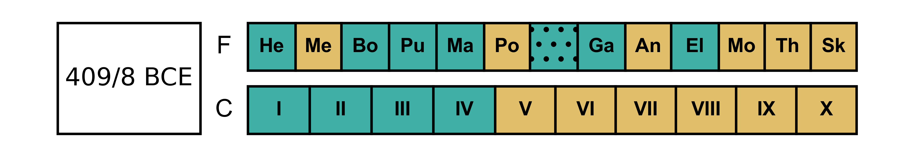
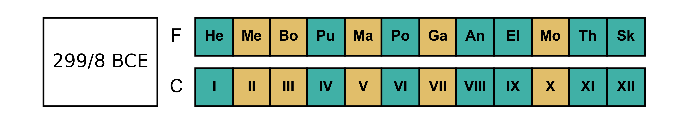
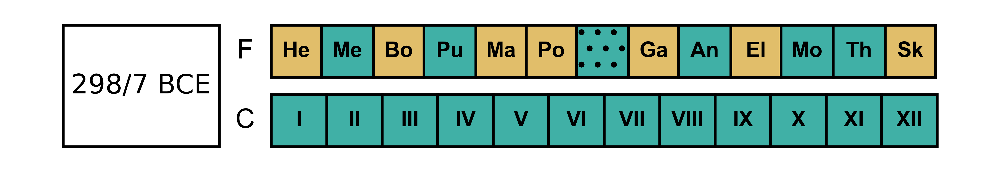
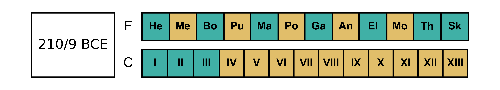
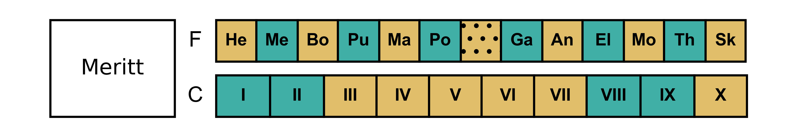
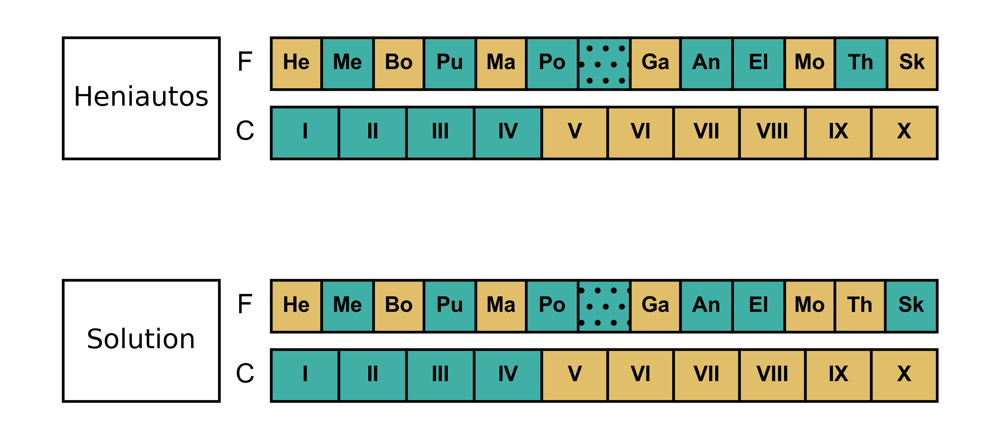

# The Conciliar Calendar

[Top: Intro](README.md) | [Previous: Festival Calendar Basics](festival-calendar-basics.md) | [Next: The `heniautos` Command](heniautos-command.md)

## 508-410 BCE

When the Athenian democracy was instituted in 508 BCE, the citizenry (meaning the population of male citizens since women had no political rights or ability to participate) was divided into ten [_phulaí_](https://logeion.uchicago.edu/%CF%86%CF%85%CE%BB%CE%AE) (singular _phulḗ_), usually translated as "tribes". These were not "tribes" in any traditional sense, but were simply arbitrary divisions of the population for civic purposes. Much voting was done by _phulḗ_, boards were often made up of one member from each _phulḗ_, and the _Boulḗ_ (or "Council") that prepared legislation and decisions to be voted on by the at-large _Ekklēsía_ (or "Assembly") was made up of 50 men chosen by lot from each _phulḗ_.

This is important for the calendar because each or the ten tribal delegations served as a standing committee for one-tenth of the year. While serving as this standing committee they were called [_prutáneis_](https://logeion.uchicago.edu/%CF%80%CF%81%CF%8D%CF%84%CE%B1%CE%BD%CE%B9%CF%82) (essentialy "presidents") and their term was a [_prutaneía_](https://logeion.uchicago.edu/%CF%80%CF%81%CF%85%CF%84%CE%B1%CE%BD%CE%B5%CE%AF%CE%B1), a "presidency" or as historians call it a "prytany". Some activities were reserved for particular prytanies. For instance, generals were usually elected in the seventh prytany.

The ten _phulaí_ in this period, in their traditional order, were:

1. Erekhthēís
2. Aigēís
3. Pandionís
4. Leōntís
5. Akamantís
6. Oinēís
7. Kekropís
8. Hippothontís
9. Aiantís
10. Antiokhís

This order was used for the rotation of some offices, such as secretary of the council. As an anti-corruption measure, however, the prytanies were chosen by lot and not very far ahead of time. It was only after one prytany was under way that the lots would be drawn to determine the next.

Athenians inscribed their offical decrees on stone in order publish them. Thousands of these inscriptions still exist and many are dated by the prytany. In the fifth century, these inscriptions usually name the [_árkhōn_](https://logeion.uchicago.edu/%E1%BC%84%CF%81%CF%87%CF%89%CE%BD) (the chief magistrate), the [_grammateús_](https://logeion.uchicago.edu/%CE%B3%CF%81%CE%B1%CE%BC%CE%BC%CE%B1%CF%84%CE%B5%CF%8D%CF%82) (secretary of the council), and the _phulḗ_ that held the prytany when the decree was passed. We can tell the year from the _árkhōn_, but the name of the tribe alone is no help because of the random order.

Sometimes, however we are luckier. In an inscription that records payments made to generals who were sent to Corcyra in 433/2, we are told that 26 talents were given to them "in Aiantis' prytany, the first prytany,
thirteen days had elapsed" and 50 talents "in Aiantis' prytany, the first prytany, on the final day of the prytany" ([IG I³ 364](https://epigraphy.packhum.org/text/375?&bookid=4&location=1701), translation from Fornara [1983] 143). When were the 13th and last days of the first prytany?

In the first period of the democracy, the prytanies operated on something like a solar year. Five of the prytanies lasted for 37 days and five for 36, for a total of 365 days. Given the evidence we have it is difficult to say on what day these conciliar years started, but `heniautos` uses the dates calculated by Meritt (1961). The `-c` option of the `heniautos` command will output the conciliar year:

    > heniautos 433 -m -c 
         Year     |        Prytany        |      Start      | Days 
    --------------|-----------------------|-----------------|-----
    BCE 433/432   | I                     | BCE 0433-Jul-04 |   37
    BCE 433/432   | II                    | BCE 0433-Aug-10 |   37
    BCE 433/432   | III                   | BCE 0433-Sep-16 |   37
    BCE 433/432   | IV                    | BCE 0433-Oct-23 |   37
    BCE 433/432   | V                     | BCE 0433-Nov-29 |   37
    BCE 433/432   | VI                    | BCE 0432-Jan-05 |   36
    BCE 433/432   | VII                   | BCE 0432-Feb-10 |   36
    BCE 433/432   | VIII                  | BCE 0432-Mar-18 |   36
    BCE 433/432   | IX                    | BCE 0432-Apr-23 |   36
    BCE 433/432   | X                     | BCE 0432-May-29 |   36

The 13th day of the 1st prytany would be about July 16 433 BCE, and the last day about August 9. Note that the prytanies have no connection to the lunar months, or in this period to the solstice. The festival year 433/2 began on July 28, or June 28 if it was intercalary which is perhaps more likely (see below, ["The Start of 433/2"](#the-start-of-4332). The lengths of the prytanies are calculated according to a rule that sought to make the time served by the _prutáneis_ as even as possible.

If the generals for the next year were elected in the 7th prytany, in 433/2 that would have meant sometime between about February 10 and March 17

## 409-308 BCE

After 410, the Athenians decided to have the conciliar year begin an end at the same time as the festival year. There were still ten prytanies though, of roughly equal length. For an ordinary year of 354 days, this meant four 36-day and six 35-day prytanies (36 × 4 + 35 × 6 = 354). If we chart the two together we can see the difference:

Here the "F" indicates the festival calendar and "C" the conciliar calendar. Like the festival months, the long prytanies are in the darker, green color, the short in the lighter tan color. Prytanies are conventionally numbered with Roman numerals. The difference between the calendars is clearest in the eighth prytany, which starts partway through Elaphēboliṓn and ends just after the middle of Mounuchiṓn

In an intercalary year, the extra days were simply distributed among the prytanies which made them 39 or 38 days (39 × 4 + 38 × 6 = 384). 409/8 was such a year.

Based on these calendars, in 409/8 the election of generals in the seventh prytany would have occurred around February 19-March 29, 408 BCE, at the end of Gamēliṓn or in Anthestēriṓn. In 408/7 it would have been around February 20-March 26, 407 BCE in Anthestēriṓn or possibly the beginning of Elaphēboliṓn.

## 307-224 BCE

In 307/6 two more tribes were added, Antogonís and Dēmētriás. With twelve tribes, the prytanies simply mirrored the festival months in an ordinary year

And in an intercalary year, since 384 is evenly divisible by 12, all the prytanies were 32-days long

## 223-201 BCE

For a short time at the end of the third century BCE, there were thirteen tribes with the addition of Ptolemaís. In an ordinary year there were three 28-day and ten 27-day prytanies

In an intercalary year, the thirteen prytanies could mirror the thirteen festival months:

Then In 200 BCE, Athens went back to twelve tribes--Antogonís and Dēmētriás were removed, while Ptolemaís remained and was supplemented by a new tribe Attalís--and this arrangement operated for another century until Athens came under firmer Roman control as a province of the Roman Empire.

## The "Rule of Aristotle"

The festival year had months of 29 and 30 days, while the conciliar calendar had prytanies that ranged from 27 and 28 days to 38 and 39 days. The festival months were synchronized with moons, but what determined how long each prytany was? 

A passage in _Athenaion Politeia_ ([43.2](http://www.perseus.tufts.edu/hopper/text?doc=Perseus%3Atext%3A1999.01.0045%3Achapter%3D43%3Asection%3D2)) implies that the longer prytanies all came at the beginning of the year. 

> πρυτανεύει δ᾽ ἐν μέρει τῶν φυλῶν ἑκάστη καθ᾽ ὅ τι ἂν λάχωσιν, αἱ μὲν πρῶται τέτταρες Ϛʹ καὶ λʹ ἡμέρας ἑκάστη, αἱ δὲ Ϛʹ αἱ ὕστεραι πέντε καὶ λʹ ἡμέρας ἑκάστη· κατὰ σελήνην γὰρ ἄγουσιν τὸν ἐνιαυτόν.

> Each of the _phulaí_ holds the prytany in turn by lot, the first four for 36 days each, the next six for 35 days each; for they regulate the year according to the moon.
 
We should take "For they regulate the year according to moon" as a contrast to what preceded it--an Athenian would have understood that meant 29 and 30 day months as opposed to 35 and 36 day prytanies, and perhaps that this meant a rule of four long prytanies followed by six short as opposed to alternating or semi-alternating full and hollow months. The idea that the long prytanies all came at the beginning of the year has come to be known as the "Rule of Aristotle" which different scholars have believed operated to different degrees (see Rhodes [1985] 518-520 for a summary). 

Except for those years when the number of prytanies is the same as the number of festival months Heniautos generates conciliar years that follow the Rule of Aristotle. This is mainly because there is no better criteria for arranging the pryanies. The festival months we have a choice of external measures: they either alternate as regularly as possible or (as Heniautos calculates them) follow the actual lunar months. However, for pytanies there is no evidence better than Aristotle's rule. Scholars have postulated a different arrangement of prytanies, such as Meritt did for 336/5 (Meritt 1961, 15):

But no theory is put forth to explain why the 1st, 2nd, 8th and 9th prytanies are long rather than, say, the 3rd, 5th, 7th, and 10th except that they satisfy Meritt's interpretation of the calendar equations in several inscriptions in such a way that allows for a regular alternation of full and hollow months (Meritt 1961, 10-15). By what mechanism would the Athenians have decided on this arrangment of prytanies except, perhaps, by lot which is _never_ mentioned in relation to the calendar?

Other interpretations are possible. In fact there is one (and only one) solution that satisifes Merrit's calendar equations _and_ follows the Rule of Aristotle. It differs from the default calculations of Heniautos only in the last two months (see [Calendar Equations](calendar-equations.md#3365-bce)):

This really amount to only single day's difference. Heniautos makes Thargēliṓn a full month ending on the 355th day of the year, Skirophoriṓn hollow beginning on the 356th. By simply ending Thargēliṓn on the 354th day and starting Skirophoriṓn on the 355th, within the "margin of error" of Heniautos' approximations, this matches the solution. 

## Hypothetical Calendars

Heniautos will generate a conciliar calendar for any year you want. For any year after the 2nd century BCE, it just uses the "classical" ten prytany schedule. If we had prytanies in 2021:

    > heniautos 2021 --as-ce -m -c
         Year     |        Prytany        |      Start      | Days
    --------------|-----------------------|-----------------|-----
     CE 2021/2022 | I                     |  CE 2021-Jul-12 |   36
     CE 2021/2022 | II                    |  CE 2021-Aug-17 |   36
     CE 2021/2022 | III                   |  CE 2021-Sep-22 |   36
     CE 2021/2022 | IV                    |  CE 2021-Oct-28 |   36
     CE 2021/2022 | V                     |  CE 2021-Dec-03 |   35
     CE 2021/2022 | VI                    |  CE 2022-Jan-07 |   35
     CE 2021/2022 | VII                   |  CE 2022-Feb-11 |   35
     CE 2021/2022 | VIII                  |  CE 2022-Mar-18 |   35
     CE 2021/2022 | IX                    |  CE 2022-Apr-22 |   35
     CE 2021/2022 | X                     |  CE 2022-May-27 |   35    

## The Start of 433/2

In [Festival Calendar Basics](festival-calendar-basics.md) (under "Heniautos and Intercalations") we noted that it was a close call, astronomically, whether or not the year 320/19 was intercalary but that the evidence of inscriptions makes it clear that it was intercalary, though Heniautos' calculates it as ordinary by default. The year 433/2 is a similar case that `heniautos` probably gets wrong.

The summer solstice of 433 BCE occured on June 28. A new moon--meaning the astronomical conjunction--occurred just before, on June 27 at 1:34 AM, Athens time. This is just enough before the solstice that `heniautos` makes 434/433 intercalary with Skirophoriṓn of that year beginning on June 28 and 433/2 ordinary with Hekatombaiṓn not starting until July 28. 

However, the inscription quoted above, IG I³ 364, provides good evidence that Hekatombaiṓn must have come earlier than July 433. The inscription records two payments to two groups of generals, the first made on prytany I 13 and the second on I 37. As Merrit observes (1961, 217) "the Treasurers of Athena, who changed office at the Panathenaia, were different on Prytany I 13 and Prytany I 37 (Merrit refers to this inscription as I² 295). On prytany I 13 the payment was made by someone, whose name is lost, "of Kerameîs and his colleagues, for whom whom Krátēs son of Naúpōn of Lamptraí was secretary. The payment of prytany I 37 was made by "Pronápēs of Erkhía and his colleagues, for whom Euthías son of Aískhrōn of Anáphlustos was secretary. Since the Panathenaia occured on Hekatombaiṓn 23-30. The month that started on June 28, 433 must have been _Hekatombaiṓn_ of 433/2 rather than Skirophoriṓn of 434/3. Hekatombaiṓn and Prytany I would have occured something like this:

| Julian | Athenian | Panathenaia | Prytany  | Payments    |
|--------|----------|-------------|----------|-------------|
| Jun 28 | Hek 01   |             | X 31     |             |
| Jun 29 | Hek 02   |             | X 32     |             |
| Jun 30 | Hek 03   |             | X 33     |             |
| Jul 01 | Hek 04   |             | X 34     |             |
| Jul 02 | Hek 05   |             | X 35     |             |
| Jul 03 | Hek 06   |             | X 36     |             |
| Jul 04 | Hek 07   |             | I 01     |             |
| Jul 05 | Hek 08   |             | I 02     |             |
| Jul 06 | Hek 09   |             | I 03     |             |
| Jul 07 | Hek 10   |             | I 04     |             |
| Jul 08 | Hek 11   |             | I 05     |             |
| Jul 09 | Hek 12   |             | I 06     |             |
| Jul 10 | Hek 13   |             | I 07     |             |
| Jul 11 | Hek 14   |             | I 08     |             |
| Jul 12 | Hek 15   |             | I 09     |             |
| Jul 13 | Hek 16   |             | I 10     |             |
| Jul 14 | Hek 17   |             | I 12     |             |
| Jul 15 | Hek 18   |             | I 13     | 1st Payment (by ? of Kerameîs, Krátēs son of Naúpōn of Lamptraí as secretary) |
| Jul 16 | Hek 19   |             | I 14     |             |
| Jul 17 | Hek 20   |             | I 15     |             |
| Jul 18 | Hek 21   |             | I 16     |             |
| Jul 19 | Hek 22   |             | I 17     |             |
| Jul 20 | Hek 23   | Panathenaia | I 18     |             |
| Jul 21 | Hek 24   | Panathenaia | I 19     |             |
| Jul 22 | Hek 25   | Panathenaia | I 20     |             |
| Jul 23 | Hek 26   | Panathenaia | I 21     |             |
| Jul 24 | Hek 27   | Panathenaia | I 22     |             |
| Jul 25 | Hek 28   | Panathenaia | I 23     |             |
| Jul 26 | Hek 29   | Panathenaia | I 24     |             |
| Jul 27 | Hek 30   | Panathenaia | I 25     |             |
| Jul 28 | Met 01   |             | I 26     |             |
| Jul 29 | Met 02   |             | I 27     |             |
| Jul 30 | Met 03   |             | I 28     |             |
| Jul 01 | Met 04   |             | I 29     |             |
| Aug 02 | Met 05   |             | I 30     |             |
| Aug 03 | Met 06   |             | I 31     |             |
| Aug 04 | Met 07   |             | I 32     |             |
| Aug 05 | Met 08   |             | I 33     |             |
| Aug 06 | Met 09   |             | I 34     |             |
| Aug 07 | Met 10   |             | I 35     |             |
| Aug 08 | Met 11   |             | I 36     |             |
| Aug 09 | Met 12   |             | I 37     | 2nd Payment (by Pronápēs of Erkhía, Euthías son of Aískhrōn of Anáphlustos, secretary) |

Another bit of circumstantial evidence is the fact that generals took office on Hekatombaiṓn 1, along with most other officials (but not the Treasurers of Athena who took office during the Panathenaia). If Hekatombaiṓn 1 was on July 28, then the first payment would have been made to either generals who were not yet in office or generals who were about to leave office. It makes much more sense if the new generals took up their posts on _June_ 28, and were then given money to prepare for an expedition to Corcyra.

There is no astronomical necessity for this arrangement of months. In fact the astronomy _slightly_ favors Hek I = July 28 with 434/3 being intercalary which is therefore the answer you will get from `heniautos`. It hardly matters though because the _historical_ evidence points strongly to Hek I = June 28 with 433/2 being intercalary. This is how Meritt (1961, 218) reconstructs it and, following him Planeaux (forthcoming) 177. This again underlines the fact that `heniautos` provides a useful framework for understanding the Athenian calendar, but historical evidence is much more important.

We can infer from IG I³ 364 that the two payments were on 

* Hek 18 = I 13 = July 15, 433 BCE
* Met 12 = I 37 = August 9, 433 BCE

This is called a "calendar equation." The best kind of historical evidence for the calendar is an inscription with an _explicit_ calendar equation (rather than an implicit one like IG I³ 364). This is a [later topic](calendar-equations.md).

[Top: Intro](README.md) | [Previous: Festival Calendar Basics](festival-calendar-basics.md) | [Next: The `heniautos` Command](heniautos-command.md)

## Works Cited

* Fornara, Charles W., ed. 1983. _Translated Documents of Greece and Rome, 1: Archaic Times to the End of the Peloponnesian War_. 2nd ed. Cambridge [Cambridgeshire] ; New York: Cambridge University Press.
* Meritt, Benjamin D. 1961. _The Athenian Year_. Sather Classical Lectures 32. Berkeley: University of California Press.
* Planeaux, Christopher. Forthcoming. _The Athenian Year Primer_.
* Rhodes, P. J. 1985. _A Commentary on the Aristotelian Athenaion Politeia_. Oxford: Oxford University Press.

