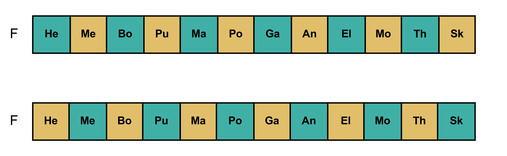
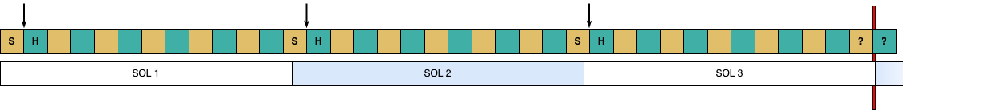
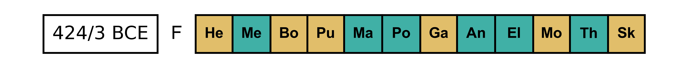
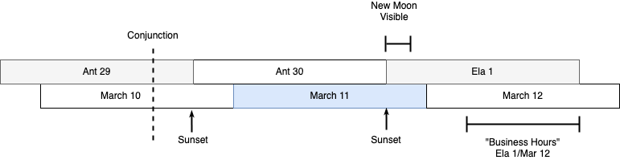

# Festival Calendar Basics

[Top: Intro](README.md) | [Next: The Conciliar Calendar](conciliar-calendar.md)

## Overview

The essential details of the Athenian calendar are:

1. Each month month began a new moon and lasted 29 or 30 days. A 29-day month was called "hollow", a 30-day "full." 
2. The year began on the first new moon after the summer solstice.
3. Most years had twelve months (354±1 days), but some needed thirteen (384±1 days). 
4. The thirteenth month was one of the ordinary months repeated, usually the sixth month, Posideiṓn. This is called "intercalation"

## Ordinary Years

The twelve lunar months of the Athenian year were named:

1. Hekatombaiṓn
2. Metageitniṓn
3. Boēdromiṓn
4. Puanopsiṓn
5. Maimaktēriṓn
6. Posideiṓn
7. Gamēliṓn
8. Anthestēriṓn
9. Elaphēboliṓn
10. Mounuchiṓn
11. Thargēliṓn
12. Skirophoriṓn

Each month began on the new moon, and the first day of the month was called [_noumēnía_](https://logeion.uchicago.edu/%CE%BD%CE%BF%CF%85%CE%BC%CE%B7%CE%BD%CE%AF%CE%B1) or, simply, "new moon." The year began on the first full moon after the summer solstice. Because Athenian years began in summer, when we convert them to modern equivalents we give them as a span of two years. For example, 424/3 BCE meaning "the year that began after the summer solstice of 424 BCE, and ran until the summer of 423 BCE."

The time between one new moon and the next--a ["lunation" or "synodic month"](https://en.wikipedia.org/wiki/Lunar_month#Synodic_month)--is 29.53 days on average, plus or minus about 7 hours in any given lunation. The practical consequence of this is that on a calendar lunar months vary between 30 and 29 days. In an "idealized" version of the Athenian calendar these 30- and 29-day months, called [_plḗrēs_](https://logeion.uchicago.edu/%CF%80%CE%BB%CE%AE%CF%81%CE%B7%CF%82) "full" and [_koîlos_](https://logeion.uchicago.edu/%CE%BA%CE%BF%E1%BF%96%CE%BB%CE%BF%CF%82) "hollow" in Greek, alternate evenly, and there are six of each in the year.

In this diagram, below, we will use the darker, green color to represent the six full months, the lighter, tan color the six hollow months. In this "ideal year" they alternate: 

Since we would like to be able to convert ancient Athenian dates into equivalents on our calendar, if you knew the modern date of the first day of the year you could use simple arithmetic to find any equivalent date in this idealized year. For instance, when was Aristophanes' _Clouds_ first performed? We know it was first staged in 424/3 BCE, during the [City Dionysia](https://en.wikipedia.org/wiki/Dionysia#City_Dionysia) which was held every year from the 10th to the 16th of Elaphēboliṓn. Elaphēboliṓn is the ninth month and, as the diagram shows, was preceded in an "idealized" year by 4 full and four hollow months. 30 × 4 + 29 × 4 = 236, so the City Dionysia would be held from the 246th day (236 + 10) of the year to the 252nd day (236 + 16). If this Athenian year had started, for instance, on July 19, 424 BCE, you could calculate the dates of the City Dionysia as March 21-27, 423 BCE.

## Intercalary Years

The same arithmetic will tell you that if this year began on July 19, 424 BCE, the next year began not on July 19, 423 but on July 8 because six full months and six hollow months add up to only 354 days (30 × 6 + 29 × 6 = 354), so twelve lunar months is 11 days shorter than the solar year of 365 days. This shortage of days will compound from year to the next and soon cause a complication.

Imagine a year in which the solstice occurs on the first day of the last month, Skirophoriṓn. In our idealized year, Skirophoriṓn is hollow so we reach the end of this year 29 days later. The next year then starts on Hekatombaiṓn 1, 29 days after solstice which we can call SOL + 29. Because of the difference in length between the solar year and 12 lunar months, the next solstice will fall not on the next Skirophoriṓn 1 but on Skirophoriṓn 12. The second year will then begin on SOL + 18 (11 days sooner than SOL + 29). The third solstice will fall on Skirophoriṓn 23, and the third year begins only 7 days later on SOL + 7. As we approach the fourth year, Skirophoriṓn ends _before_ the solstice and if Hekatombaiṓn were start right away it would be on SOL _minus_ 4. Clearly a problem if we say the year begins on the first new moon _after_ the solstice.

In the diagram below, the top row represents the Athenian years with their months alternating between full (green) and hollow (tan). Each Skirophoriṓn is marked "S". The beginning of each Athenian year is indicated by the arrow and by Hekatombaiṓn marked "H". The bottom row represents the solar year running 365 days from solstice to solstice. The "red zone" at the end shows where the twelfth month ends before the solstice.

The ancient Greeks solved this by adding another month to the calendar when necessary. This is called an "intercalation" and a year with an intercalation is called "intercalary" (as opposed to "ordinary"). As the scenario above shows, about every third year you will need a thirteenth month to extend the year past the solstice. The Athenians usually intecalated in the middle of the year, which we represent in this diagram as a month with the pattern of dots:

This idealized intercalary year has thirteen months, 7 full and 6 hollow, adding up to 384 days.

This intercalation follows the month Posideiṓn and would be called _Posideiṓn hústeros_ "later Posideiṓn", _Posideiṓn deúteros_ "second Posideiṓn" or _Posideiṓn embólimos_ "injected Posideiṓn." When we abbreviate we will indicate this with a subscript number 2: Pos₂ 

Returning to the first performance of Aristophanes' _Clouds_, what if it happened in an intercalary year? If it was like the one illustrated above, Elaphēboliṓn would be the _10th_ month and everything would be 30 days later. The City Dionysia would happen on the 276th to the 282nd day of the year, April 21-27 if the year began on July 19.

Posideiṓn was the most common, but _any_ month could be intercalated. The dates of the City Dionysia could just as well be delayed by an intercalated Hekatombaiṓn:

But if the last month, Skirophoriṓn, were intercalated that would not affect the dates of any previous month: 

In this scenario, Elaphēboliṓn is still the ninth month, just as in an "ordinary" year.

How do we know if a year was intercalary or not? We don't--unless we have a dated inscription or some other evidence that tells us. Without knowing whether or not a year was intercalary, or what month was intercalated, you must assume that any ancient date could be off by 30 days. We can, however, use astronomy as a guide.

## Heniautos & Astronomy

Heniautos can generate example calendars for ancient dates based on modern calculations of ancient solstices and new moons. It has long been a matter of debate how rigid or flexible the Athenians were with their calendar and whether it was based on some system, on direct observation of the crescent of the new moon or on calculation. Heniautos uses a simplistic approximation of observation (and optionally calculation) to generate what the calendar for a year might have been, by default, if the new moon was observed on the second day after the [conjunction](https://en.wikipedia.org/wiki/Conjunction_(astronomy)). 

Here is the calendar for 424/3 BCE (showing output from the Heniautos command):

    > heniautos 424 -m
         Year     |        Month          |      Start      | Days
    --------------|-----------------------|-----------------|-----
    BCE 424/423   | Hekatombaiṓn          | BCE 0424-Jul-19 |   29
    BCE 424/423   | Metageitniṓn          | BCE 0424-Aug-17 |   30
    BCE 424/423   | Boēdromiṓn            | BCE 0424-Sep-16 |   29
    BCE 424/423   | Puanopsiṓn            | BCE 0424-Oct-15 |   29
    BCE 424/423   | Maimaktēriṓn          | BCE 0424-Nov-13 |   30
    BCE 424/423   | Posideiṓn             | BCE 0424-Dec-13 |   30
    BCE 424/423   | Gamēliṓn              | BCE 0423-Jan-12 |   29
    BCE 424/423   | Anthestēriṓn          | BCE 0423-Feb-10 |   30
    BCE 424/423   | Elaphēboliṓn          | BCE 0423-Mar-12 |   30
    BCE 424/423   | Mounuchiṓn            | BCE 0423-Apr-11 |   29
    BCE 424/423   | Thargēliṓn            | BCE 0423-May-10 |   30
    BCE 424/423   | Skirophoriṓn          | BCE 0423-Jun-09 |   29    

The command `heniautos 424` gives us the year that began in 424 BCE (that is, 424/3) The `-m` option tells Heniautos to output a monthly summary (see [`heniautos` Command](heniautos-command.md) for details). The fields are the Athenian Year, the month, the Julian date of the first day of the month, and the number of days in the month. As you can see, actual astronomical lunations _are_ either 29 or 30 days, but they do _not_ alternate regularly. This is more clear on a chart of the full and hollow months: 

In 434 BCE the summer solstice was on June 28. The new moon, as defined by the astronomical conjunction, occurred at 9:10 in the morning (Athens time) on July 17. If the first sliver of the waxing crescent became visible on the second evening afterwards, then the Hekatombaiṓn would have started on July 19. The first days of the following months are calculated in the same way from the following astronomical conjunctions.

What does this give us for the dates of the City Dionysia? Without the `-m` option used above, Heniautos will output the whole year. The output is abbreviated below to show just the days we are interested in. The fields are the Athenian Year, the month, the day of the month, the Julian date, and the day of the year:

    > heniautos 424
    ...
    BCE 424/423   | Elaphēboliṓn          |  10 | BCE 0423-Mar-21 | 246
    BCE 424/423   | Elaphēboliṓn          |  11 | BCE 0423-Mar-22 | 247
    BCE 424/423   | Elaphēboliṓn          |  12 | BCE 0423-Mar-23 | 248
    BCE 424/423   | Elaphēboliṓn          |  13 | BCE 0423-Mar-24 | 249
    BCE 424/423   | Elaphēboliṓn          |  14 | BCE 0423-Mar-25 | 250
    BCE 424/423   | Elaphēboliṓn          |  15 | BCE 0423-Mar-26 | 251
    BCE 424/423   | Elaphēboliṓn          |  16 | BCE 0423-Mar-27 | 252
    ...
    
Exactly the same. The full and hollow months are in a different order, but, if you count them, Elaphēboliṓn happens to be preceded again by 4 full and 4 hollow months.

By default, Heniautos places the "observed" new moon two days after the conjunction. This is merely an approximation since the there are many factors that go into determining when the first sliver of the waxing crescent moon can be observed at a given location--not least of all the care taken and eyesight of the people making the observations.

Heniautos provides three options for this approximation. The default is the "second day rule" which you can explicitly enable with `heniautos -r 2`. `heniautos -r 1` will give you the dates according to a "next day rule" by which the new moons are observed on the next day after the conjunction. `-r 0` will generate dates as if the Athenians began their months on the day of the conjunction. For the year 424/3 BCE, the only effect is advancing the date. With `-r 1` the pattern of full and hollow months is the same, but the year starts on July 18 rather than July 19:

    > heniautos 424 -m -r 1
         Year     |        Month          |      Start      | Days
    --------------|-----------------------|-----------------|-----
    BCE 424/423   | Hekatombaiṓn          | BCE 0424-Jul-18 |   29
    BCE 424/423   | Metageitniṓn          | BCE 0424-Aug-16 |   30
    BCE 424/423   | Boēdromiṓn            | BCE 0424-Sep-15 |   29
    BCE 424/423   | Puanopsiṓn            | BCE 0424-Oct-14 |   29
    BCE 424/423   | Maimaktēriṓn          | BCE 0424-Nov-12 |   30
    BCE 424/423   | Posideiṓn             | BCE 0424-Dec-12 |   30
    BCE 424/423   | Gamēliṓn              | BCE 0423-Jan-11 |   29
    BCE 424/423   | Anthestēriṓn          | BCE 0423-Feb-09 |   30
    BCE 424/423   | Elaphēboliṓn          | BCE 0423-Mar-11 |   30
    BCE 424/423   | Mounuchiṓn            | BCE 0423-Apr-10 |   29
    BCE 424/423   | Thargēliṓn            | BCE 0423-May-09 |   30
    BCE 424/423   | Skirophoriṓn          | BCE 0423-Jun-08 |   29 
    
And one day sooner again with `-r 0`:

    > heniautos 424 -m -r 0 
         Year     |        Month          |      Start      | Days
    --------------|-----------------------|-----------------|-----
    BCE 424/423   | Hekatombaiṓn          | BCE 0424-Jul-17 |   29
    BCE 424/423   | Metageitniṓn          | BCE 0424-Aug-15 |   30
    BCE 424/423   | Boēdromiṓn            | BCE 0424-Sep-14 |   29
    BCE 424/423   | Puanopsiṓn            | BCE 0424-Oct-13 |   29
    BCE 424/423   | Maimaktēriṓn          | BCE 0424-Nov-11 |   30
    BCE 424/423   | Posideiṓn             | BCE 0424-Dec-11 |   30
    BCE 424/423   | Gamēliṓn              | BCE 0423-Jan-10 |   29
    BCE 424/423   | Anthestēriṓn          | BCE 0423-Feb-08 |   30
    BCE 424/423   | Elaphēboliṓn          | BCE 0423-Mar-10 |   30
    BCE 424/423   | Mounuchiṓn            | BCE 0423-Apr-09 |   29
    BCE 424/423   | Thargēliṓn            | BCE 0423-May-08 |   30
    BCE 424/423   | Skirophoriṓn          | BCE 0423-Jun-07 |   29

The median of the number of hours after the astronomical conjunction that the new moon becomes visible (at Athens) is 41.5 hours (see Dunn 1998, 214-216) or just under two days--between the `-r 1` and `-r 2` options Any of these options is adequate for saying the that the City Dionysia took place, and Aristophanes' _Clouds_ staged for the first time _around_ March 21-27, 423 BCE.

While the traditional Greek calendar was replaced by the Julian calendar as Greece came under closer control by the Roman Empire, this method still allows us to make a hypothetical Athenian calendar for any year, including modern ones. Heniautos treats the years you give it as BCE by default, but with the `--as-ce` parameter you can change this and get a calendar for, say, 2021/2 CE:

    > heniautos 2021 -m --as-ce 
         Year     |        Month          |      Start      | Days
    --------------|-----------------------|-----------------|-----
     CE 2021/2022 | Hekatombaiṓn          |  CE 2021-Jul-12 |   29
     CE 2021/2022 | Metageitniṓn          |  CE 2021-Aug-10 |   30
     CE 2021/2022 | Boēdromiṓn            |  CE 2021-Sep-09 |   29
     CE 2021/2022 | Puanopsiṓn            |  CE 2021-Oct-08 |   29
     CE 2021/2022 | Maimaktēriṓn          |  CE 2021-Nov-06 |   30
     CE 2021/2022 | Posideiṓn             |  CE 2021-Dec-06 |   29
     CE 2021/2022 | Gamēliṓn              |  CE 2022-Jan-04 |   30
     CE 2021/2022 | Anthestēriṓn          |  CE 2022-Feb-03 |   29
     CE 2021/2022 | Elaphēboliṓn          |  CE 2022-Mar-04 |   30
     CE 2021/2022 | Mounuchiṓn            |  CE 2022-Apr-03 |   29
     CE 2021/2022 | Thargēliṓn            |  CE 2022-May-02 |   30
     CE 2021/2022 | Skirophoriṓn          |  CE 2022-Jun-01 |   30

## Heniautos and Intercalations
 
Heniautos intercalates when it is astronomically necessary. The year 406/5, for instance, begins on July 1 and the twelfth month ends on June 18, too soon for the next month to begin after the summer solstice. Heniautos therefore intercalates a second Posideiṓn (by default):

    > heniautos 406 -m  
         Year     |        Month          |      Start      | Days
    --------------|-----------------------|-----------------|-----
    BCE 406/405   | Hekatombaiṓn          | BCE 0406-Jul-01 |   29
    BCE 406/405   | Metageitniṓn          | BCE 0406-Jul-30 |   29
    BCE 406/405   | Boēdromiṓn            | BCE 0406-Aug-28 |   30
    BCE 406/405   | Puanopsiṓn            | BCE 0406-Sep-27 |   29
    BCE 406/405   | Maimaktēriṓn          | BCE 0406-Oct-26 |   30
    BCE 406/405   | Posideiṓn             | BCE 0406-Nov-25 |   29
    BCE 406/405   | Posideiṓn hústeros    | BCE 0406-Dec-24 |   30
    BCE 406/405   | Gamēliṓn              | BCE 0405-Jan-23 |   30
    BCE 406/405   | Anthestēriṓn          | BCE 0405-Feb-22 |   29
    BCE 406/405   | Elaphēboliṓn          | BCE 0405-Mar-22 |   30
    BCE 406/405   | Mounuchiṓn            | BCE 0405-Apr-21 |   30
    BCE 406/405   | Thargēliṓn            | BCE 0405-May-21 |   29
    BCE 406/405   | Skirophoriṓn          | BCE 0405-Jun-19 |   30

The diagram for the year looks like this:

If you require accuracy, for scholary or other reasons, you need to take care with intercalations. These astronomical calculations are a good guide, but in the abscence of historical evidence we cannot be sure that any year was ordinary or intercalary. We are not sure how the Athenians decided when to intercalate not do we know how much they were concerned with astronomical accuracy. When a new moon is very close to the solstice, when and how the moon was observed becomes very important. Take the years 321-319, for instance. If we give Heniautos two years, a start year and an end year, it will generate the calendar for all years in the range. This is most useful with the `-y` or year summary option but works with others as well. The fields in the year summary are the Athenian year, whether the year is ordinary (O) or intercalary (I), and the Julian date of the first day of the year.

    > heniautos 321 319 -y 
         Year     | Y |      Start      | Days
    --------------|---|-----------------|-----
    BCE 321/320   | O | BCE 0321-Jul-19 |  355
    BCE 320/319   | O | BCE 0320-Jul-09 |  354
    BCE 319/318   | I | BCE 0319-Jun-28 |  384
    
By the default "second day rule" Heniautos makes the year 320/19 ordinary and 319/8 intercalary. 319/318 begins on the day of the solstice however, so 320/19 lasts just long enough to not need intercalation. With the next day rule, however:

    > heniautos 321 319 -y -r 1
         Year     | Y |      Start      | Days
    --------------|---|-----------------|-----
    BCE 321/320   | O | BCE 0321-Jul-18 |  355
    BCE 320/319   | I | BCE 0320-Jul-08 |  384
    BCE 319/318   | O | BCE 0319-Jul-27 |  354

This shifts the dates so that 320/19 is intercalated and 319/8 ordinary. In fact we know from two inscriptions ([IG II² 381](https://epigraphy.packhum.org/text/2598?hs=250-274) & [382](https://epigraphy.packhum.org/text/2599?hs=267-289)) that 320/9 had a _Posideiṓn hústeros_. For 320/19 BCE, `-r 0` or `-r 1` will give a defensible result, the default `-r 2` will not.

## Why "Festival Calendar"?

There was another calendar used in Athens from the 5th century to the 2nd century BCE, called (by modern historians) the conciliar calendar, which regulated business of the Ekklēsía and which we will talk about next. The festival calendar is so called because it provided timing for the many, many religious celebrations that Athens held. Some days were always sacred to a particular god--the 3rd of every month to Athena and 7th to Apollo for example. The first few days of every month were taken up with festivals like this (Mikalson 1976 14-20). Other celebrations were held once a year, including the major Athenian festivals (Mikalson 1976 201): 

* Panathenaia: Hekatombaiṓn 23-30
* Eleusinia: Metageitniṓn 15-18
* Apatouria: Puanopsiṓn 19-21 or 26-28
* Lenaia: Gamēliṓn 12-21
* Lesser Eleusinia: Anthestēriṓn 20-26
* City Dionysia: Elaphēboliṓn 10-16

## Why Two Days? `-r 2` vs. `-r 1` or `-r 0`

If the ancient Athenians used observations of the new moon to fix the beginning of each month (a hypothesis used by Heniautos) then exactly what "observation" means takes a little explaining. The conjunction (by which astronomers define the new moon) is the moment when the Earth, Moon, and Sun are all in a line. This moment often happens in the the daytime, and the moon is only ever visible at the conjunction when it causes an eclipse. The "common-sense" definition of the new moon is not the conjunction but the moment when the first sliver of a waxing crescent is visible to the human eye.

To return to the example of Elaphēboliṓn 424/3, Heniautos calculates its first day as March 12, 423 BCE. There was an (astronomical) new moon on March 10 at 2:36 PM. When the sun set that evening the moon was probably low on the horizon and almost certainly too faint to see. The default "second day" rule used by Heniautos assumes that the crescent is not visible until the day after the conjunction. If the moon was visible on the next day, though, March 11, why not say that this was the first day of Elaphēboliṓn?

The ancient Greeks defined the day as beginning at sunset (most, but not all, scholars agree), not at midnight or sunrise as we do. When the conjunction occured in the afternoon of March 10, it would have been Anthestēriṓn 29 in Athens. When the sun set that evening the next day began, so it was now Anthestēriṓn 30 to an Athenian even though to us it was still March 10. When the first light of the crescent was observed after sunset on March 11, the Athenian would say "Now it is Elaphēboliṓn." Therefore Elaphēboliṓn 424/3 technically did start in the evening of March 11. However, if there was a meeting of the Ekklēsía on Elaphēboliṓn 1, it would have happened in the daylight hours on March 12. For simplicity we say that the equivalent Greek and Julian days are the days of these overlapping "business" hours, as indicated on the chart below.

The top row shows the span of the Greek days, beginning at sunsets (marked by the arrows). The bottom row shows "modern" days, offset because they begin at midnight.

This is the same as the Jewish and Islamic calendars still in use. Days begin at sunset so while we say that Shabbat is "Saturday" it begins in the evening on Friday, as Juma is "Friday" but begins on Thursday. The modern Jewish and Islamic calendars are identical in many ways the to Greek calendar and they all descend from the ancient [Babylonian Calendar](https://en.wikipedia.org/wiki/Babylonian_calendar)

[Top: Intro](README.md) | [Next: The Conciliar Calendar](conciliar-calendar.md)

## Works Cited

Dunn, Francis M. 1998. “Tampering with the Calendar.” _Zeitschrift Für Papyrologie und Epigraphik_ 123: 213–31.
Mikalson, Jon D. 1976. _Sacred and Civil Calendar of the Athenian Year_. Princeton: Princeton University Press.

    