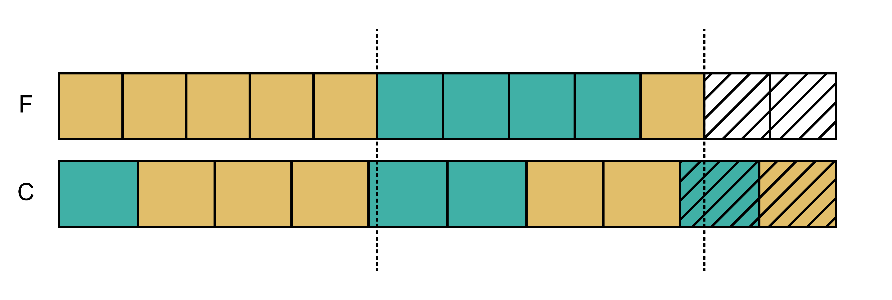
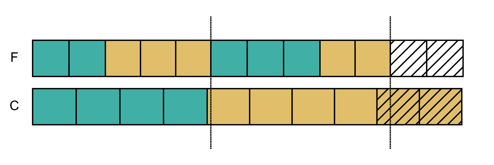

# Programming with Heniautos

[Top: Intro](README.md) | [Previous: `calendar-equation` Command](calendar-equations-command.md) | [Next: Reading Dated Inscriptions](reading-dated-inscriptions.md)

## Overview

The most important functions in Heniautos, if you are looking to generate calendars, are:

* `festival_calendar()`
* `prytany_calendar()`

To understand the difference between the two, see [Festival Calendar Basics](festival-calendar-basics.md) and [The Conciliar Calendar](conciliar-calendar.md). 

To use these functions you will need to know about some constants and working with BCE years

And if you are working with calendar equations, the important functions are:

* `festival_doy()`
* `prytany_doy()`
* `equations()`
* `collations()`

## Initializing Data

Throughout this guide, we will assume that Heniautos has been imported with this command:

    >>> import heniautos as ha
    
Therefore all Heniautos functions and constants will be prefixed with `ha.`

You will need to initialize the Henautos data before using any functions that do calendar calculations. This is necessary to set up some of the configuration required by the [Skyfield](https://rhodesmill.org/skyfield/) that Heniautos uses.

    >>> ha.init_data()
    'de422.bsp'
    
`init_data()` returns the path to the [ephemeris](https://rhodesmill.org/skyfield/planets.html) or file containing astronomical data it is using. By default, this is the first copy of a file named `de422.bsp` it can find in the file path.

If a copy of the file cannot be found it will automatically be downloaded into the current working directory. Since the file is over 600 MB, it is best to avoid this so, perhaps after downloading it the first time, keep a copy where you can remember its location and give the path to the ephemeris to `init_data()`

    >>> ha.init_data(eph="/full/path/to/you/copy/of/de422.bsp")
    '/full/path/to/you/copy/of/de422.bsp'
    
You only need to initailized the data once in a session or script, you cannot reinitialize it without forcing with `ha.init_data(force=True)`

## Constants

There are a number of constants that occur in the return values of many function and can be used as parameters.

### `ha.Months`

These constants represent months in the Athenian calendar:

    >>> list(ha.Months)
    [<Months.HEK: 1>, <Months.MET: 2>, <Months.BOE: 3>, 
    <Months.PUA: 4>, <Months.MAI: 5>, <Months.POS: 6>, <Months.GAM: 7>, 
    <Months.ANT: 8>, <Months.ELA: 9>, <Months.MOU: 10>, 
    <Months.THA: 11>, <Months.SKI: 12>, <Months.INT: 13>, 
    <Months.UNC: 14>]
    
You can always use integer values like 1 for Hekatombaiṓn or 9 for Elaphēboliṓn, but it is safer (and easier) to use `ha.Months.HEK` and `ha.Months.ELA`. An intercalated month is always represented by `INT`. `UNC` is explained under `ha.Visible.DINSMOOR`.

### `ha.Prytanies`

Like months, there are constants for representing prytanies.

    >>> list(ha.Prytanies)
    [<Prytanies.I: 1>, <Prytanies.II: 2>, <Prytanies.III: 3>, 
    <Prytanies.IV: 4>, <Prytanies.V: 5>, <Prytanies.VI: 6>, 
    <Prytanies.VII: 7>, <Prytanies.VIII: 8>, <Prytanies.IX: 9>, 
    <Prytanies.X: 10>, <Prytanies.XI: 11>, <Prytanies.XII: 12>, 
    <Prytanies.XIII: 13>]
    
### Tuple Convention

In many places, a tuple consisting of one of the above constants with an integer for the day of the month or prytany is used to represent a full date. For example, `(ha.Months.ELA, 10)` for Elaphēboliṓn 10, or `(ha.Prytanies.VIII, 21)` for prytany VIII 21.

### Prytany Types

The concilar calendar consisted of a different number of prytanies (10, 12, or 13) at [different times in Athens' history](conciliar-calendar.md), corresponding to the number of _phulaí_ (or tribes) that existed. Some functions for calendar equations need to know how many prytanies are required. `ha.Prytany` represents these with the following values:

| Value             | Meaning | Years in effect |
|-------------------|---------|-----------------|
| `ha.Prytany.AUTO` | Determine based on year (passed to function separately) | |
| `ha.Prytany.QUASI_SOLAR` | 10 prytanies based on a separate 365-day concilar year | 508-410 BCE |
| `ha.Prytany.ALIGNED_10` | 10 prytanies beginning and ending with the festival calendar | 409-308 BCE | 
| `ha.Prytany.ALIGNED_12` | 12 prytanies beginning and ending with the festival calendar | 307-224 BCE, 200-101 BCE |
| `ha.Prytany.ALIGNED_13` | 13 prytanies beginning and ending with the festival calendar | 223-201 BCE |
    
### Visibility Rules

Heniautos approximates the observation of the new moon by counting a certain number of days after the astronomical conjunction. The default is two days after--that is, if the new moon conjunction is June 10, Heniautos calculates it as visible June 12 and therefore starts a month on that date. For functions that calculate lunar months you can set this to 1 or 0 days using these constants:

| Value                    | Meaning  |
|--------------------------|----------|
| `ha.Visible.CONJUNCTION` | New moon observed day of astronomical conjunction |
| `ha.Visible.NEXT_DAY`    | New moon observed 1 day after conjunction |
| `ha.Visible.SECOND_DAY`  | (Default) New moon observed 2 days after conjunction |
| `ha.Visible.DINSMOOR`    | Use dates calculated by Dinsmoor (see below) 

### Other Constants

These are used interally by Heniautos but may be useful for your own programs

#### `ha.Seasons`

Solar events. See `solar_events()`, below.

    >>> list(ha.Seasons)
    [<Seasons.SPRING_EQUINOX: 0>, <Seasons.SUMMER_SOLSTICE: 1>, 
    <Seasons.AUTUMN_EQUINOX: 2>, <Seasons.WINTER_SOLSTICE: 3>]
    
#### `ha.Phases`

Phases of the moon. See `moon_phases()`, below.

    >>> list(ha.Phases)
    [<Phases.NEW: 0>, <Phases.FIRST_Q: 1>, <Phases.FULL: 2>, 
    <Phases.LAST_Q: 3>]
    
#### Month Names, and Abbreviations

These are available, but you should use `month_label()` (and `prytany_label()`), below.

    >>> ha.MONTH_NAMES
    ('Hekatombaiṓn', 'Metageitniṓn', 'Boēdromiṓn', 'Puanopsiṓn', 
    'Maimaktēriṓn', 'Posideiṓn', 'Gamēliṓn', 'Anthestēriṓn', 
    'Elaphēboliṓn', 'Mounuchiṓn', 'Thargēliṓn', 'Skirophoriṓn')

    >>> ha.MONTH_ABBREVS
    ('Hek', 'Met', 'Boe', 'Pua', 'Mai', 'Pos', 'Gam', 'Ant', 'Ela', 'Mou', 
    'Tha', 'Ski')

    >>> ha.MONTH_NAMES_GK
    ('Ἑκατομβαιών', 'Μεταγειτνιών', 'Βοηδρομιών', 'Πυανοψιών', 
    'Μαιμακτηριών', 'Ποσιδειών', 'Γαμηλιών', 'Ἀνθεστηριών', 'Ἑλαφηβολιών', 
    'Μουνυχιών', 'Θαργηλιών', 'Σκιροφοριών')

## Generating Calendars

### `bce_as_negative()`

Calendar calculations require a year, and if since you are working with _ancient_ Greek calendars, those years will probably by BCE. Years BCE are represented as negative numbers counting backwards from 0 = 1 BCE. This means that -99 = 100 BCE, -299 = 300 BCE, etc. To make this simpler, `bce_as_negative()` converts a _positive_ BCE year number to the required negative integer:

    >>> ha.bce_as_negative(300)
    -299

`bce_as_negative` works in reverse, but if you want to be more explicit in your code, you can use the alias `negative_as_bce`:

    >>> ha.negative_as_bce(-299)
    300

### `festival_calendar()`, `by_months()`

This generates a full Athenian calendar for a given year. For instance, to get the calendar for 350 BCE:

    >>> ha.festival_calendar(-349)

Or, using `bce_as_negative()`:    
    
    >>> ha.festival_calendar(ha.bce_as_negative(350))

The return value is a list of `FestivalDay` objects. `FestivalDay` is a `namedtuple` with the following members:

| name         | Type             | Description                   |
|--------------|------------------|-------------------------------|
| jdn          | `int`            | Julian Day Number             |
| `month_name` | `str`            | Name of month                 |
| month_index  | `int`            | Order (1-13) of month in year |
| month        | heniautos.Months | Identifer of the month        |
| day          | `int`            | Day of the month (1-30)       |
| doy          | `doy`            | Day of the year (1-385)       |

The function `by_months` will convert this this is into a tuple of tuples, containing one tuple for each month;

    >>> # Get the calendar for 350 BCE
    >>> c = ha.festival_calendar(ha.bce_as_negative(350))
	>>> c_months = ha.by_months(c)
    >>> # How many months?
    >>> len(c_months)
    12

    >>> # Get the 3rd month
    >>> m = c_months[2]
    >>> # How many days?
    >>> len(m)
    30
	>>> # Every FestivalDay in the month has the same month details
    >>> m[0].month_name
    'Boēdromiṓn'
    >>> m[0].month
    <Months.BOE: 3>
    
    >>> # Get the 15th day (Boēdromiṓn 15)
    >>> d = m[14]
    >>> d.day
    15
    >>> d.doy
    74

For conversions to modern (Julian or Gregorian) calendar dates, see "Working with Julian Day Numbers".

#### Intercalations

Intercalations are made when astronomically necessary--when the twelfth month would end before the summer solstice. By default, this is handled by adding an intercalary Posideiṓn.

    >>> c = ha.festival_calendar(ha.bce_as_negative(301))
	>>> c_months = ha.by_months(c)
    >>> # If there are 13 months, it is intercalary
    >>> len(c_months)
    13
    >>> # 6th month should be Posideiṓn
    >>> c_months[5][0].month_name
    'Posideiṓn'
    >>> # 7th month would normally be Gamēliṓn but...
    >>> c_months[6][0].month_name
    'Posideiṓn hústeros'
    >>> # The intercalary month is always identified by Months.INT
    >>> c_months[6][0].month
    <Months.INT: 13>
	
Note the the `month_index` and integer value of `Months` will be equal for months preceding the intercalary month, but not those following

    >>> f"{c_months[0][0].month} == {c_months[0][0].month_index}"
    '1 == 1'
    >>> f"{c_months[-1][0].month} == {c_months[-1][0].month_index}"
    '12 == 13'

In this case, the last month of the year `<Months.SKI: 12>` is _normally_ the twelfth month, but is the thirteenth in this year, following the intercalary _Posideiṓn hústeros_.

Any month could be intercalated. To generate a calendar with a specific intercalation, use the `intercalate` parameter with a `Months` constant. For intstance, if we pass `Months.HEK` this will generate a calendar with an intercalary _Hekatombaiṓn hústeros_ as the second month rather than _Posideiṓn hústeros_ as the seventh:

    >>> c = ha.festival_calendar(ha.bce_as_negative(301), intercalate=ha.Months.HEK)
    >>> [d[0].month_name for d in ha.by_months(c)]
    ['Hekatombaiṓn', 'Hekatombaiṓn hústeros', 'Metageitniṓn', 'Boēdromiṓn', 'Puanopsiṓn', 'Maimaktēriṓn', 'Posideiṓn', 'Gamēliṓn', 'Anthestēriṓn', 'Elaphēboliṓn', 'Mounuchiṓn', 'Thargēliṓn', 'Skirophoriṓn']	
	
	
This has no effect if the year is not intercalary:

    >>> c = ha.festival_calendar(ha.bce_as_negative(300), intercalate=ha.Months.HEK)
    >>> [d[0].month_name for d in ha.by_months(c)]
    ['Hekatombaiṓn', 'Metageitniṓn', 'Boēdromiṓn', 'Puanopsiṓn', 'Maimaktēriṓn', 'Posideiṓn', 'Gamēliṓn', 'Anthestēriṓn', 'Elaphēboliṓn', 'Mounuchiṓn', 'Thargēliṓn', 'Skirophoriṓn']

    
#### Changing the Visibility Rule

As described above, Heniautos has different rules for approximating the day when the new moon becomes visible, and a new month starts. A specific rule can be selected by supplying a `Visibility` constant as the `rule` parameter. The effect is mostly to move the corresponding Julian dates earlier that the default.

    >>> c = ha.festival_calendar(ha.bce_as_negative(350))
    >>> # Julian date of the first day of the first month
    >>> ha.as_eet(c[0]["days"][0]["date"])
    'BCE 0350-Jul-11'    
    >>> c = ha.festival_calendar(ha.bce_as_negative(350), rule=ha.Visible.NEXT_DAY)
    >>> ha.as_eet(c[0]["days"][0]["date"])
    'BCE 0350-Jul-10'
    >>> c = ha.festival_calendar(ha.bce_as_negative(350),  rule=ha.Visible.CONJUNCTION)
    >>> ha.as_eet(c[0]["days"][0]["date"])
    'BCE 0350-Jul-09' 

(see below for the as `as_eet()` function)

#### Dinsmoor "Visibility"

There is one more rule, `Visible.DINSMOOR`. This uses dates as calculated by William Dinsmoor in Dinsmoor (1931) Tables IX-XXV (pp. 424-440).

    >>> c = ha.festival_calendar(ha.bce_as_negative(350), rule=ha.Visible.DINSMOOR)
    >>> ha.as_eet(c[0]["days"][0]["date"])
    'BCE 0350-Jul-11'
    
In this example, Dinmoor's calculation is the same as as Heniautos' default but this is not always the case. There are some years for which Dinsmoor leaves the specific months undetermined. They are identified by the constant `Months.UNC` (for "uncertain"):

    >>> c = ha.festival_calendar(ha.bce_as_negative(311), rule=ha.Visible.DINSMOOR)
    >>> c[0]["constant"]
    <Months.UNC: 14>
    
These dates are provided for their historical interest. Many discussions of the Athenian calendar began with Dinsmoor's dates in the decades after the publication of _The Archons of Athens in the Hellenistic Age_. However, a great number of the inscriptions Dinsmoor relied on as evidence of the character of specific years have since been redated, and can no longer serve the purposes for which Dinmoor used them,

#### Other Parameters

To get the month names as abbreviations use `abbrev=True`. To get them in Greek, use `greek=True`

    >>> c = ha.festival_calendar(ha.bce_as_negative(350))
    >>> c[0]["month"]
    'Hekatombaiṓn'
    >>> c = ha.festival_calendar(ha.bce_as_negative(350), abbrev=True)
    >>> c[0]["month"]
    'Hek'
    >>> c = ha.festival_calendar(ha.bce_as_negative(350), greek=True)
    >>> c[0]["month"]
    'Ἑκατομβαιών'
    
`greek` overrides `abbrev`. See `month_label()` below for using the `Month` constant to get the transliteration, abbreviation, or Greek name.

### Formatting Dates

Every day returned by `festival_calendar()` has a Julian date equivalent. This is a Skyview `Time` object, as noted above. Use `as_eet()` to get a string representation of the date in Athens time (Eastern European Time) or `as_gmt()` to get Greenwich Mean Time.

    >>> ha.as_eet(c[0]["days"][0]["date"])
    'BCE 0350-Jul-11'
    >>> ha.as_gmt(c[0]["days"][0]["date"])
    'BCE 0350-Jul-11' 
    
Add `full=True` to get the date _and_ time (this will make the time zone difference apparent)

    >>> ha.as_eet(c[0]["days"][0]["date"], full=True)
    'BCE 0350-Jul-11 13:59:17 EET'
    >>> ha.as_gmt(c[0]["days"][0]["date"], full=True)
    'BCE 0350-Jul-11 11:59:17 GMT'
    
Neither makes any adjustments for Daylight Savings Time.

### `prytany_calendar()`

Use `prytany_calendar` to get the full calendar for the [concilar year](conciliar-year.md):

    >>> c = ha.prytany_calendar(ha.bce_as_negative(350))
    
The return value is a nested data structure, similar to that from `festival_calendar()`

| Level | Object   | Type    | Contains |
|-------|----------|---------|------------------------|
| 0     | Year     | `tuple` | one `dict` per prytany |
| 1     | Month    | `dict`  | "prytany": `str`, "constant": `ha.Prytanies` constant, "days": `tuple` |
| 2     | Days     | `tuple` | one `dict` per day    |
| 3     | Day      | `dict`  | "day": `int`, the day of the prytany, "date": `Time` object, "doy": `int`, the day of the year     |

    >>> c = ha.prytany_calendar(ha.bce_as_negative(350))
    >>> # How many prytanies?
    >>> len(c)
    10
    
    >>> # Get the 3rd prytany
    >>> p = c[2]
    >>> p["prytany"]
    3
    >>> p["constant"]
    <Prytanies.III: 3>
    >>> # How many days?
    >>> len(p["days"])
    36
    
    >>> # Get the 15th day of the prytany
    >>> d = p["days"][14]
    >>> ha.as_eet(d["date"])
    'BCE 0350-Oct-05'
    >>> d["doy"]
    87

By default, the number of prytanies are determined by the year (see table under "Prytany Types" above)

    >>> c = ha.prytany_calendar(ha.bce_as_negative(400))
    >>> len(c)
    10
    >>> c = ha.prytany_calendar(ha.bce_as_negative(300))
    >>> len(c)
    12
    >>> c = ha.prytany_calendar(ha.bce_as_negative(210))
    >>> len(c)
    13
    >>> c = ha.prytany_calendar(ha.bce_as_negative(200))
    >>> len(c)
    12
    >>> c = ha.prytany_calendar(ha.bce_as_negative(100))
    >>> len(c)
    10
    
Once Roman rule of Athens was firm, the prytany calendar ceased to be used, so the last example, for 100 BCE, is hypothetical. Any year after 201 BCE will have 10 of these "hypothetical" prytanies--this is mainly so you can easily generate a "Classical" prytany calendar for a modern year

    >>> c = ha.prytany_calendar(2021)
    >>> ha.as_eet(c[0]["days"][0]["date"])
    ' CE 2021-Jul-12'
    
You can specify a different number of prytanies via the `pryt_type` parameter, which takes a `Prytany` constant (default `Prytany.AUTO`)

    >>> # There were 12 prytanies in the year 300 BCE
    >>> c = ha.prytany_calendar(ha.bce_as_negative(300))
    >>> len(c)
    12

    >>> # This the default, Prytany.AUTO...
    >>> c = ha.prytany_calendar(ha.bce_as_negative(300), pryt_type=ha.Prytany.AUTO)
    >>> len(c)
    12

    # ...which, for 300 BCE is Prytany.ALIGNED_12  
    >>> c = ha.prytany_calendar(ha.bce_as_negative(300), pryt_type=ha.Prytany.ALIGNED_12)
    >>> len(c)
    12

    >>> # But you can ask for a 10 prytany calendar
    >>> c = ha.prytany_calendar(ha.bce_as_negative(300), pryt_type=ha.Prytany.ALIGNED_10)
    >>> len(c)
    10
    
    >>> # Or a 13 prytany calendar
    >>> c = ha.prytany_calendar(ha.bce_as_negative(300), pryt_type=ha.Prytany.ALIGNED_13)
    >>> len(c)
    13

#### Quasi-solar Conciliar Calendars

The "aligned" versions of the conciliar calendar begin and end on the same days as the festival calendar. For most of the fifth century BCE, though, the concilar calendar was a 365-day "solar" year that began on it's own day (although this day changed over time)

    >>> c = ha.festival_calendar(ha.bce_as_negative(430))
    >>> # The festival year started on...
    >>> ha.as_eet(c[0]["days"][0]["date"])
    'BCE 0430-Jul-25'
    
    >>> # But the CONCILIAR year started on...
    >>> c = ha.prytany_calendar(ha.bce_as_negative(430))
    >>> ha.as_eet(c[0]["days"][0]["date"])
    'BCE 0430-Jul-04'
    
The default start days are taken from Meritt (1961) 218. These "quasi-solar" conciliar years always started in July, but you can specify a different day in July with the `pryt_start` parameter:

    >>> # Default for 430 BCE
    >>> c = ha.prytany_calendar(ha.bce_as_negative(430))
    >>> ha.as_eet(c[0]["days"][0]["date"])
    'BCE 0430-Jul-04'
    
    >>> # Different day in July
    >>> c = ha.prytany_calendar(ha.bce_as_negative(430), pryt_start=10)
    >>> ha.as_eet(c[0]["days"][0]["date"])
    'BCE 0430-Jul-10'
    
    >>> # July 9 is the default day for "Hypothetical" quasi-solar 
    >>> # conciliar calendars
    >>> c = ha.prytany_calendar(ha.bce_as_negative(300), pryt_type=ha.Prytany.QUASI_SOLAR)
    >>> ha.as_eet(c[0]["days"][0]["date"])
    'BCE 0300-Jul-09'

Heniautos does not try to gracefully handle the transition from "quasi-solar" to "aligned" conciliar years between 410 and 409 BCE.

#### Rule of Aristotle

Heniautos produces conciliar calendars that follow Rule of Aristotle--out of expediency because, unlike the festival calendar and the moon, there no other external guide to the ordering of long and short prytanies. In this example you can see that the first four prytanies are 36-days long and the remaining 35:

    >>> c = ha.prytany_calendar(ha.bce_as_negative(350))
    >>> [len(m["days"]) for m in c]
    [36, 36, 36, 36, 35, 35, 35, 35, 35, 35]

There are two cases where the Rule is not followed by default. In ordinary years in the period of twelve _phulaí_, because there were twelve prytanies and twelve festival months, the lengths of the prytanies simply follow the festival calendar. The same is true for intercalary years in the period of thirteen _phulaí_, when there were _thirteen_ prytanies and _thirteen_ festival months. With `rule_of_aristotle=True` you can force the Rule during these periods as well.

    >>> # Lengths of lunar festival months in 297 BCE
    >>> c = ha.festival_calendar(ha.bce_as_negative(297))
    >>> [len(m["days"]) for m in c]
    [30, 30, 29, 30, 29, 30, 29, 29, 30, 29, 30, 29]
    
    >>> # Lengths of 12 prytanies the same
    >>> c = ha.prytany_calendar(ha.bce_as_negative(297))
    >>> [len(m["days"]) for m in c]
    [30, 30, 29, 30, 29, 30, 29, 29, 30, 29, 30, 29]    
    
    >>> # Apply the rule to put all the 30-day prytanies first
    >>> c = ha.prytany_calendar(ha.bce_as_negative(297), rule_of_aristotle=True)
    >>> [len(m["days"]) for m in c]
    [30, 30, 30, 30, 30, 30, 29, 29, 29, 29, 29, 29]
    
The math of these prytany lengths was calculated for ordinary years with 354 and intercalary years of 384 days. Some years, though, have one day more or one day fewer. In these years the last day is added or subtracted producing a "pseudo-long" or "pseudo-short" prytany that appears to violate the Rule, or an inconsistent prytany length:

    >>> # 346 BCE has 355 days
    >>> c = ha.festival_calendar(ha.bce_as_negative(346))
    >>> sum([len(m["days"]) for m in c])
    355
    >>> # The conciliar year ends with a pseudo-long prytany
    >>> c = ha.prytany_calendar(ha.bce_as_negative(346))
    >>> [len(m["days"]) for m in c]
    [36, 36, 36, 36, 35, 35, 35, 35, 35, 36]
    
    >>> # 306 has 383 days
    >>> c = ha.festival_calendar(ha.bce_as_negative(306))
    >>> sum([len(m["days"]) for m in c])
    383
    >>> # The prytanies have 32-days, except for the last
    >>> c = ha.prytany_calendar(ha.bce_as_negative(306))
    >>> [len(m["days"]) for m in c]
    [32, 32, 32, 32, 32, 32, 32, 32, 32, 32, 32, 31]

#### Visibility Rules

`prytany_calendar()` also takes a `rule` parameter. This has no effect for quasi-solar conciliar years. For all other years types of conciliar calendar the visibility rule is used to detemine the first and last days of the year, as well as the start days of all prytanies for the periods when these follow the lunar months

### Month and Prytany Names

Use `month_label()` to get a human-readable name for a `Months` constant. This takes the same `abbrev` and `greek` parameters described for `festival_calendar()`:

    >>> ha.month_label(ha.Months.ELA)
    'Elaphēboliṓn'
    >>> ha.month_label(ha.Months.ELA, abbrev=True)
    'Ela'
    >>> ha.month_label(ha.Months.ELA, greek=True)
    'Ἑλαφηβολιών'
    
Roman numerals are conventionally used for prytanies. Use `prytany_label` to get these for `Prytanies` constants
    
    >>> ha.prytany_label(ha.Prytanies.VIII)
    'VIII'
    
### Finding Dates Directly

Rather than generating an entire calendar, you may only want find the Athenian date for a Julian date or vice versa. All of these functions take the  same `intercalate`, `abbrev`, `greek`, and `rule` parameters as `festival_calendar()` and `prytany_calendar()`.

#### `find_date()`

`find_date()` will lookup the Athenan calendar date and return the same data structure you would from the innermost nesting of `festival_calendar()`:

    >>> ha.find_date(ha.bce_as_negative(350), ha.Months.BOE, 15)
    {'month': 'Boēdromiṓn', 'constant': <Months.BOE: 3>, 'day': 15, 'date': <Time tt=1593849.9999935674>, 'doy': 74}
    
Use `Months.INT` to get the data for a date in an intercalary month, whichever that is:

    >>> ha.find_date(ha.bce_as_negative(300), ha.Months.INT, 15)
    {'month': 'Posideiṓn hústeros', 'constant': <Months.INT: 13>, 'day': 15, 'date': <Time tt=1612217.9999942768>, 'doy': 192}

#### `festival_to_julian()`

If you just want the get straight to the Julian day, use `festival_to_julian()`. It returns a Skyfield `Time` object, so you will probably want to use `as_eet()` or `as_gmt()` to make it human readable.

    >>> ha.festival_to_julian(ha.bce_as_negative(350), ha.Months.BOE, 15)
    <Time tt=1593849.9999935674>
    >>> ha.as_eet(ha.festival_to_julian(ha.bce_as_negative(350), ha.Months.BOE, 15))
    'BCE 0350-Sep-22'
    
#### `prytany_to_julian()`

You can start from a prytany day as well.

    >>> ha.prytany_to_julian(ha.bce_as_negative(350), ha.Prytanies.III, 15)
    <Time tt=1593862.9999935674>
    >>> ha.as_eet(ha.prytany_to_julian(ha.bce_as_negative(350), ha.Prytanies.III, 15))
    'BCE 0350-Oct-05'

## Calendar Equations

[Calendar equations](calendar_equations.md) are the core of research into the ancient Athenian calendar. A calendar equation is any evidence--probably an inscription that records a dated decree--that links a date on the festival calendar to a date on the conciliar calendar. These give us clues about the nature of the years that they record. The method of "solving" calendar equations is essentially to calculate the possible days of the year for each date could be and seeing if there is any overlap.

### `festival_doy()`

Given a festival date, `festival_doy()` returns a a `tuple` of `dict`s where each `dict` is A data structure representing A possible DOY and the conditions it requires. The data structure consists of:

| Name            | Type    | meaning                                                                              |
|-----------------|---------|--------------------------------------------------------------------------------------|
| "date"          | `tuple` | A `Months` constant and integer representing the Month and day                       |
| "doy"           | `int`   | The DOY (serial day of the year)                                                     |
| "preceding"     | `tuple` | A `tuple` of `int`s giving the lengths of the preceding months required for this DOY |
| "intercalation" | `bool`  | `True` if the this DOY requires one of the _preceding_ months to be an intercalation |

For example:

    >>> ha.festival_doy(ha.Months.MET, 10)
    ({'date': (<Months.MET: 2>, 10), 'doy': 39, 'preceding': (29,), 'intercalation': False}, {'date': (<Months.MET: 2>, 10), 'doy': 40, 'preceding': (30,), 'intercalation': False}, {'date': (<Months.MET: 2>, 10), 'doy': 68, 'preceding': (29, 29), 'intercalation': True}, {'date': (<Months.MET: 2>, 10), 'doy': 69, 'preceding': (30, 29), 'intercalation': True}, {'date': (<Months.MET: 2>, 10), 'doy': 70, 'preceding': (30, 30), 'intercalation': True})
    
The first possibility:

    `{'date': (<Months.MET: 2>, 10), 'doy': 39, 'preceding': (29,), 'intercalation': False}` 
    
can be read as "Met 10 can be the 39th day of the year, if it is preceded by 1 29-day month with no intercalation." The last possibility: 

    `{'date': (<Months.MET: 2>, 10), 'doy': 70, 'preceding': (30, 30), 'intercalation': True})` 
    
can be read as "Met 10 can be the 70th day of the year if it is preceded by 2 30-day months, and one of these must be an intercalation."

Dates later in the year will have more possible DOYs due to the greater number of possible combinations of full and hollow months. Note that these calculations are only concerned with the _count_ of full and hollow months, not their order. For example:

    >>> ha.festival_doy(ha.Months.THA, 18)
    ({'date': (<Months.THA: 11>, 18), 'doy': 312, 'preceding': (30, 30, 30, 30, 29, 29, 29, 29, 29, 29), 'intercalation': False}, {'date': (<Months.THA: 11>, 18), 'doy': 313, 'preceding': (30, 30, 30, 30, 30, 29, 29, 29, 29, 29), 'intercalation': False}, {'date': (<Months.THA: 11>, 18), 'doy': 314, 'preceding': (30, 30, 30, 30, 30, 30, 29, 29, 29, 29), 'intercalation': False}, {'date': (<Months.THA: 11>, 18), 'doy': 315, 'preceding': (30, 30, 30, 30, 30, 30, 30, 29, 29, 29), 'intercalation': False}, {'date': (<Months.THA: 11>, 18), 'doy': 341, 'preceding': (30, 30, 30, 30, 29, 29, 29, 29, 29, 29, 29), 'intercalation': True}, {'date': (<Months.THA: 11>, 18), 'doy': 342, 'preceding': (30, 30, 30, 30, 30, 29, 29, 29, 29, 29, 29), 'intercalation': True}, {'date': (<Months.THA: 11>, 18), 'doy': 343, 'preceding': (30, 30, 30, 30, 30, 30, 29, 29, 29, 29, 29), 'intercalation': True}, {'date': (<Months.THA: 11>, 18), 'doy': 344, 'preceding': (30, 30, 30, 30, 30, 30, 30, 29, 29, 29, 29), 'intercalation': True})
    
The first possibility here, for DOY 312, has a "preceding" value of `(30, 30, 30, 30, 29, 29, 29, 29, 29, 29)`. This means that to be DOY 312, Tha 18 must be preceded by four 30-day and 6 29-day months (because (4 × 30) + (6 × 29) + 18 = 312), no matter what order they actually come in. Thargēliṓn is normally the 11th month, so it is normally preceded by 10 months. In an intercalary year it could be preceded by 11 months giving us, for instance, the last possibilty, DOY 344. The "preceding" value is `(30, 30, 30, 30, 30, 30, 30, 29, 29, 29, 29)`, seven 30-day and four 29-day months, no matter their order and no matter which one of them is intercalated.

Note also that the first possibility, DOY 312 with `'intercalation': False` does _not_ preclude an intercalary year, just that an intercalation happens before Thargēliṓn. In an intercalary year DOY 312 is still possible for Tha 18 as long as the incalation comes _after_ ordinary Thargēliṓn.
    
### `prytany_doy()`

`prytany_doy()` is the conciliar year equivalent of `festival_doy()`. In addition to a prytany (`Prytanies` constant) and day, you must indicate how many prytanies are expected by either specifying a `pryt_type`, or a `year` (the default `pryt_type` is `Prytany.AUTO` so you can pass this as the `pryt_type` or not. The Met 10 date above comes from IG II³ 1,338 which we used an an example in [Calendar Equations](calendar-equations.md). That inscription has a prytany date of I 39 and comes from the year 333/2 BCE, when there were 10 prytanies. `prytany_doy()` could be invoked for this prytany date with just the year:

    >>> ha.prytany_doy(ha.Prytanies.I, 39, ha.bce_as_negative(333))
    
with the year and explicit assignment of `Prytany.AUTO`

    >>> ha.prytany_doy(ha.Prytanies.I, 39, ha.bce_as_negative(333), pryt_type=ha.Prytany.AUTO)
    
or with an explicit `pryt_type`:

    >>> ha.prytany_doy(ha.Prytanies.I, 39, pryt_type=ha.Prytany.ALIGNED_10)
    
All three are equivalent. We will use the explicit `pryt_type` in the examples below. The data is returned in a format equivalent to the `festival_doy()` data.

    >>> ha.prytany_doy(ha.Prytanies.I, 39, pryt_type=ha.Prytany.ALIGNED_10)
    ({'date': (<Prytanies.I: 1>, 39), 'doy': 39, 'preceding': (), 'intercalation': True},)
    
This is very early in the year, so there is only one possibility. There are no preceding prytanies (`'preceding': ()`) because we are still in the first prytany. "IX 9 is the 39th day of the year, preceded by no prytanies, in an intercalary year"

`'intercalation': True` has a different meaning for the conciliar year than for the festival year. Here, `'intercalation': True` means the _year_ is intercalary, regardless of whether the intercalation happens before or after this prytany. This is because intercalation affects the length of the prytanies, so we know this is an intercalary year simply from the fact that the first prytany has 39 days--in an ordinary 10-prytany year the longest prytanies are only 36 days.

As with the festival year, the possibilites multiply the later you get into the year. The Thargēliṓn 18 example, above, comes from IG II³,1 372 (324/3 BCE), where the prytany date is IX 29:

    >>> ha.prytany_doy(ha.Prytanies.IX, 29, pryt_type=ha.Prytany.ALIGNED_10)
    ({'date': (<Prytanies.IX: 9>, 29), 'doy': 311, 'preceding': (36, 36, 35, 35, 35, 35, 35, 35), 'intercalation': False}, {'date': (<Prytanies.IX: 9>, 29), 'doy': 312, 'preceding': (36, 36, 36, 35, 35, 35, 35, 35), 'intercalation': False}, {'date': (<Prytanies.IX: 9>, 29), 'doy': 313, 'preceding': (36, 36, 36, 36, 35, 35, 35, 35), 'intercalation': False}, {'date': (<Prytanies.IX: 9>, 29), 'doy': 335, 'preceding': (39, 39, 38, 38, 38, 38, 38, 38), 'intercalation': True}, {'date': (<Prytanies.IX: 9>, 29), 'doy': 336, 'preceding': (39, 39, 39, 38, 38, 38, 38, 38), 'intercalation': True}, {'date': (<Prytanies.IX: 9>, 29), 'doy': 337, 'preceding': (39, 39, 39, 39, 38, 38, 38, 38), 'intercalation': True})
    
`prytany_doy()` does not attempt to apply the Rule of Aristotle. The first possibility, DOY 311, requires an ordinary year with two 36-day and six 35-day prytanies preceding. Since the year requires 4 36 day prytanies in total, if these are the first eight then the last two must be the remaining 36-day prytanies. This arrangement does not follow the Rule of Aristotle. 

### `doy_to_julian`

For convenience, if you simply want to know the Julian date of a DOY, use `doy_to_julian()`

    >>> ha.as_eet(ha.doy_to_julian(311, ha.bce_as_negative(324)))
    'BCE 0323-May-29'
    >>> ha.as_eet(ha.doy_to_julian(311, ha.bce_as_negative(324), rule=ha.Visible.NEXT_DAY))
    'BCE 0323-May-28'

### `equations()`

When we try to solve a calendar equation we ask "Which of the possible DOYs for this festival date are also possible DOYs for this conciliar date?" The `equations()` function will do this figuring for you. In its simplest form it takes a tuple for the festival date, a tuple for the conciliar date, and an indication (`pryt_type` or `year`) of how many prytanies are expected. For our IG II³,1 372 example, Tha 18 = IX 29, this is:

    >>> ha.equations((ha.Months.THA, 18), (ha.Prytanies.IX, 29), pryt_type=ha.Prytany.ALIGNED_10)
    (({'date': (<Months.THA: 11>, 18), 'doy': 312, 'preceding': (30, 30, 30, 30, 29, 29, 29, 29, 29, 29), 'intercalation': False}, {'date': (<Prytanies.IX: 9>, 29), 'doy': 312, 'preceding': (36, 36, 36, 35, 35, 35, 35, 35), 'intercalation': False}), ({'date': (<Months.THA: 11>, 18), 'doy': 313, 'preceding': (30, 30, 30, 30, 30, 29, 29, 29, 29, 29), 'intercalation': False}, {'date': (<Prytanies.IX: 9>, 29), 'doy': 313, 'preceding': (36, 36, 36, 36, 35, 35, 35, 35), 'intercalation': False}))

The return value is a tuple of nested tuple. Each interior tuple consists of two `dicts`, one for the festival DOY and one for the conciliar DOY, in the formats returned by `festival_doy()` and `prytany_doy()`. The result above contains two possibilites, DOY 312 and DOY 313--it is the intersection of the `festival_doy()` result for Tha 18 and the `prytany_doy()` result for IX 29. Put another way, there were 8 possible DOY values for Tha 18 and 6 for IX 29 and out of the 48 possible combinations, only these two have matching DOYs. These results can be summarized as follows:

| DOY | Festival Requirements                               | Conciliar Requirements                      |
|-----|-----------------------------------------------------|---------------------------------------------|
| 312 | 4 full, 6 hollow months preceding. No intercalation | 3 36-day, 5 35-day prytanies. Ordinary year |
| 313 | 5 full, 5 hollow months preceding. No intercalation | 4 36-day, 4 35-day prytanies. Ordinary year |

It is possible to have festival requirement with no incalation and conciliar requirement with intercalation because the festival requirement is only concerned with whether the intercalation precedes the festival date. It is _not_ possible to have a festival result with intercalation and a conciliar result without.

#### Multiple dates

Often, you need to test multiple dates. Sometimes this is because the Greek name of the day has two interpretations, such as the last day of the month, ἕνη καὶ νέα, which could be the 29th or 30th. Other times it is because the date in an inscription needs to be restored and there are multiple possibilites. For instance, in Agora XVI 91, an inscription from earlier in the same year as IG II³,1 372, the festival date is (restored as) [Ποσιδε]ῶνος [τρίτηι μετ’ εἰκάδας], or "Third from the end of Posideiṓn". If Posideiṓn is full, τρίτηι μετ’ εἰκάδας is the 28th; if Posideiṓn is empty, τρίτηι μετ’ εἰκάδας is the 27th.

To accomodate this, `equations()` can take a tuple of tuple for either the festival date or the prytany date (or both). We express τρίτηι μετ’ εἰκάδας as `((Months.POS, 27), (Months.POS, 28))` (the conciliar date in this inscription is V 31    
    
    >>> ha.equations(((ha.Months.POS, 27), (ha.Months.POS, 28)), (ha.Prytanies.V, 31), pryt_type=ha.Prytany.ALIGNED_10)
    (({'date': (<Months.POS: 6>, 27), 'doy': 172, 'preceding': (29, 29, 29, 29, 29), 'intercalation': False}, {'date': (<Prytanies.V: 5>, 31), 'doy': 172, 'preceding': (36, 35, 35, 35), 'intercalation': False}), ({'date': (<Months.POS: 6>, 27), 'doy': 173, 'preceding': (30, 29, 29, 29, 29), 'intercalation': False}, {'date': (<Prytanies.V: 5>, 31), 'doy': 173, 'preceding': (36, 36, 35, 35), 'intercalation': False}), ({'date': (<Months.POS: 6>, 28), 'doy': 173, 'preceding': (29, 29, 29, 29, 29), 'intercalation': False}, {'date': (<Prytanies.V: 5>, 31), 'doy': 173, 'preceding': (36, 36, 35, 35), 'intercalation': False}), ({'date': (<Months.POS: 6>, 27), 'doy': 174, 'preceding': (30, 30, 29, 29, 29), 'intercalation': False}, {'date': (<Prytanies.V: 5>, 31), 'doy': 174, 'preceding': (36, 36, 36, 35), 'intercalation': False}), ({'date': (<Months.POS: 6>, 28), 'doy': 174, 'preceding': (30, 29, 29, 29, 29), 'intercalation': False}, {'date': (<Prytanies.V: 5>, 31), 'doy': 174, 'preceding': (36, 36, 36, 35), 'intercalation': False}), ({'date': (<Months.POS: 6>, 27), 'doy': 175, 'preceding': (30, 30, 30, 29, 29), 'intercalation': False}, {'date': (<Prytanies.V: 5>, 31), 'doy': 175, 'preceding': (36, 36, 36, 36), 'intercalation': False}), ({'date': (<Months.POS: 6>, 28), 'doy': 175, 'preceding': (30, 30, 29, 29, 29), 'intercalation': False}, {'date': (<Prytanies.V: 5>, 31), 'doy': 175, 'preceding': (36, 36, 36, 36), 'intercalation': False}))
    
In all of the examples above, the single dates output where the same as single dates input, but here we can see the need for the date to be specified in the returned data. This output can be summarized like this:

| DOY | F. Date | F. Requirements                              | C. Date | Conciliar Requirements                      |
|-----|---------|----------------------------------------------|---------|---------------------------------------------|
| 172 | Pos 27  | 5 hollow months preceding. No intercalation  | V 31    | 1 36-day, 4 35-day prytanies. Ordinary year |
| 173 | Pos 27  | 1 full, 4 hollow. No intercalation           | V 31    | 2 36-day, 2 35-day. Ordinary year           |
| 173 | Pos 28  | 5 hollow. No intercalation                   | V 31    | 2 36-day, 2 35-day. Ordinary year           |
| 174 | Pos 27  | 2 full, 3 hollow. No intercalation           | V 31    | 3 36-day, 1 35-day. Ordinary year           |
| 174 | Pos 28  | 1 full 4 hollow                              | V 31    | 3 36-day, 1 35-day. Ordinary year           |
| 175 | Pos 27  | 3 full, 2 hollow. No intercalation           | V 31    | 4 36-day. Ordinary year                     | 
| 175 | Pos 28  | 2 full, 3 hollow. No intercalation           | V 31    | 4 36-day. Ordinary year                     |

5 hollow months in a row would be impossible, but Heniautos does not try to exclude solutions that are mathematically possible but astronomically impossible.

#### Some Recipes

You can construct the nested tuples any way you like for `equations()`, but here are some recipes for common scenarios

Any day in a Month (Posideiṓn)

    [(ha.Months.POS, d) for d in range(31)]
    
Any day in a prytany (V)

    [(ha.Prytanies.V, d) for d in range(40)]
    
Any day in the teens, for instance if an inscription just has [...]  ἐπὶ δέκα, which could be anything from 11 to 19:

    [(ha.Months.POS, d) for d in range(11, 20)]
    
The fifteenth of any month. Here we need to take a slice of the `Months` to exclude `Months.INT` and `Months.UNC`:

    [(m, 15) for m in list(ha.Months)[0:12]]
    
The fifteenth of any prytany

    [(p, 15) for m in ha.Pytanies]

The fifteenth of any prytany, for 10 prytanies only

    [(p, 15) for p in list(ha.Prytanies)[0:10]]
    
Any day of any month:

    from itertools import product
    list(product(list(ha.Months)[0:12], range(31)))
    
Any day of any prytany:

    from itertools import product
    list(product(ha.Prytanies, range(40)))

### `collations()`

The goal of working with calendar equations is to find multiple equations for a single year that can combined to give a fuller picture of the entire year. Heniautos calls these "collations." Two equations can be "collated" if the solution to an earlier one is "contained" within a later one. For example `'preceding': (30, 30, 29, 29), 'intercalation': False` can be collated with `'preceding': (30, 30, 30, 29, 29, 29), 'intercalation': True` because:

* There are two full and two hollow months in three full and three hollow months
* It can be true that there is no intercalation before the 5th month but there is one before the 7th month. That is, the intercalated month could be the 5th or 6th.

`'preceding': (30, 30, 30, 29), 'intercalation': False` cannot be collated with `'preceding': (30, 30, 29, 29, 29, 29), 'intercalation': True` because there are not three full months in two full months. 

`'preceding': (30, 30, 29, 29), 'intercalation': True` cannot be collated wth `'preceding': (30, 30, 30, 29, 29, 29), 'intercalation': False` because it cannot be true that there is an intercalation before the 5th month but no intercalation before the 7th month.

`collations()` takes any number of results from `equations()` and returns the possible collations. For example, we can collate the equations from Agora XVI 91, Pos 27/28 = IV 31, with IG II³,1 372, Tha 18 = IX 29

    >>> eq1 = ha.equations(((ha.Months.POS, 27), (ha.Months.POS, 28)), (ha.Prytanies.V, 31), pryt_type=ha.Prytany.ALIGNED_10)
    >>> eq2 = ha.equations((ha.Months.THA, 18), (ha.Prytanies.IX, 29), pryt_type=ha.Prytany.ALIGNED_10)
    >>> c = ha.collations(eq1, eq2)
    >>> len(c)
    12
    
The output is a tuple of dicts and we can see are twelve collations of these two equations.

| Level | Object     | Type    | Contains                                             |
|-------|------------|---------|------------------------------------------------------|
| 0     | Collations | `tuple` | one `dict` per collation                             |
| 1     | Collation  | `dict`  | "partitions": `dict`, "equations": `tuple`           |
| 2     | Partitions | `dict`  | "festival": `tuple`, "conciliar": `tuple`. See below |
| 2     | Equations  | `tuple` | tuple of equations                                   |

These data structures are getting very complicated and nested, but that is the nature of the beast.

Each collation is made up of partitions and equations. The equations are just pairs of festival and conciliar solutions as return by `equations`, and each collation has as many pairs as there were input equations. "Partitions" , are the arrangments of months that can be collated. To take the example we used above, collating `(30, 30, 29, 29)` with `(30, 30, 30, 29, 29, 29)` the partitions are `((30, 30, 29, 29), (30, 29))`. As we said before, two full and two hollow months are contained in three full and three hollow. If you take the first from the second, you are left with one full and one hollow, and these are the partitions. If we take the first collation:

    >>> c[0]
    {'partitions': {'festival': ((29, 29, 29, 29, 29), (30, 30, 30, 30, 29)), 'conciliar': ((36, 35, 35, 35), (36, 36, 35, 35))}, 'equations': (({'date': (<Months.POS: 6>, 27), 'doy': 172, 'preceding': (29, 29, 29, 29, 29), 'intercalation': False}, {'date': (<Prytanies.V: 5>, 31), 'doy': 172, 'preceding': (36, 35, 35, 35), 'intercalation': False}), ({'date': (<Months.THA: 11>, 18), 'doy': 312, 'preceding': (30, 30, 30, 30, 29, 29, 29, 29, 29, 29), 'intercalation': False}, {'date': (<Prytanies.IX: 9>, 29), 'doy': 312, 'preceding': (36, 36, 36, 35, 35, 35, 35, 35), 'intercalation': False}))}

And try to show its structure like so:

* partitions: 
    * festival: ((29, 29, 29, 29, 29), (30, 30, 30, 30, 29))
    * conciliar: ((36, 35, 35, 35), (36, 36, 35, 35))
* equations: 
    * 1 (Pos 27 = V 31)
        * {'date': (\<Months.POS: 6\>, 27), 'doy': 172, 'preceding': (29, 29, 29, 29, 29), 'intercalation': False} 
        * {'date': (\<Prytanies.V: 5\>, 31), 'doy': 172, 'preceding': (36, 35, 35, 35), 'intercalation': False})
    * 2 (Tha 18 = IX 29)
        * {'date': (\<Months.THA: 11\>, 18), 'doy': 312, 'preceding': (30, 30, 30, 30, 29, 29, 29, 29, 29, 29), 'intercalation': False}
        * {'date': (\<Prytanies.IX: 9\>, 29), 'doy': 312, 'preceding': (36, 36, 36, 35, 35, 35, 35, 35), 'intercalation': False}

In "equations" we have two solutions to the input equations that can be collated. In "partitions" we have the partitions of the festival and conciliar years that the collation requires. We can illustrate them graphically like this:

This is not a particulary good solution to the two equations because it requires the first five months to be hollow, and extravagantly violates the Rule of Aristotle. The last collation is a bit more orderly:
 
    >>> c[-1]
    {'partitions': {'festival': ((30, 30, 29, 29, 29), (30, 30, 30, 29, 29)), 'conciliar': ((36, 36, 36, 36), (35, 35, 35, 35))}, 'equations': (({'date': (<Months.POS: 6>, 28), 'doy': 175, 'preceding': (30, 30, 29, 29, 29), 'intercalation': False}, {'date': (<Prytanies.V: 5>, 31), 'doy': 175, 'preceding': (36, 36, 36, 36), 'intercalation': False}), ({'date': (<Months.THA: 11>, 18), 'doy': 313, 'preceding': (30, 30, 30, 30, 30, 29, 29, 29, 29, 29), 'intercalation': False}, {'date': (<Prytanies.IX: 9>, 29), 'doy': 313, 'preceding': (36, 36, 36, 36, 35, 35, 35, 35), 'intercalation': False}))}
    
* partitions
    * festival: ((30, 30, 29, 29, 29), (30, 30, 30, 29, 29))
    * conciliar: ((36, 36, 36, 36), (35, 35, 35, 35))}, 
* equations:
    * 1 (Pos 28 = V 31)
        * {'date': (\<Months.POS: 6\>, 28), 'doy': 175, 'preceding': (30, 30, 29, 29, 29), 'intercalation': False}, 
        * {'date': (\<Prytanies.V: 5\>, 31), 'doy': 175, 'preceding': (36, 36, 36, 36), 'intercalation': False}
    * 2 (Tha 18 = IX 29) 
        * {'date': (\<Months.THA: 11\>, 18), 'doy': 313, 'preceding': (30, 30, 30, 30, 30, 29, 29, 29, 29, 29), 'intercalation': False}
        * {'date': (\<Prytanies.IX: 9\>, 29), 'doy': 313, 'preceding': (36, 36, 36, 36, 35, 35, 35, 35), 'intercalation': False}

These partitions are all astronomically possible, and it follows the Rule of Aristotle:

## Other Astronomical Functions

There are a few functions for getting raw astronomical data.

### `new_moons(year [, data])`

Returns a list Julian dates for the new moons of any year.

    >>> ha.new_moons(-349)
    [1593597.933602722, 1593627.3649196504, ...]
    
### `visible_new_moons(year, [rule=Visible.SECOND_DAY] [, data])`

Returns a list of Julian Day Numbers for the times of the visible new moons (according to the `rule` parameter, `Visibility.SECOND_DAY` by default).

    >>> ha.visible_new_moons(-349)
    [1593600, 1593629, ...]
    >>> ha.visible_new_moons(-349, ha.Visible.NEXT_DAY)
    [1593599, 1593628, ...]
    >>> ha.visible_new_moons(-349, ha.Visible.CONJUNCTION)
    [1593598, 1593627, ...]
    
### `moon_phases(year, phase [, data])`

For any phase of the moon, use `moon_phases()` with one of the `Phases` constants.

    >>> [ha.as_eet(m, full=True) for m in ha.moon_phases(ha.bce_as_negative(350), ha.Phases.FULL)]
    ['BCE 0350-Jan-28 18:40:12 EET', 'BCE 0350-Feb-27 10:16:15 EET', 'BCE 0350-Mar-28 23:00:26 EET', 'BCE 0350-Apr-27 09:02:32 EET', 'BCE 0350-May-26 16:58:35 EET', 'BCE 0350-Jun-24 23:46:34 EET', 'BCE 0350-Jul-24 06:37:59 EET', 'BCE 0350-Aug-22 14:45:41 EET', 'BCE 0350-Sep-21 01:08:42 EET', 'BCE 0350-Oct-20 14:16:55 EET', 'BCE 0350-Nov-19 06:03:23 EET', 'BCE 0350-Dec-18 23:49:21 EET']
    
### `summer_solstice(year [, data])`

Returns the date and time of the summer solstice.

    >>> ha.as_eet(ha.summer_solstice(ha.bce_as_negative(350)), full=True)
    'BCE 0350-Jun-28 11:09:27 EET'
    
`ha.summer_solstice(-349)` is the equivalent of `ha.solar_event(-349, ha.Seasons.SUMMER_SOLSTICE)`
    
### `solar_event(year, event [, data])`

Returns the date and time of any solstice or equinox, specified as one of the `Seasons` constants.

    >>> ha.as_eet(ha.solar_event(ha.bce_as_negative(350), ha.Seasons.AUTUMN_EQUINOX), full=True)
    'BCE 0350-Sep-28 15:23:10 EET'

## Works Cited

* Dinsmoor, William Bell. 1931. _The Archons of Athens in the Hellenistic Age_. Cambridge: Harvard University Press.
* Meritt, Benjamin D. 1961. _The Athenian Year_. Sather Classical Lectures 32. Berkeley: University of California Press.

 This work is licensed under a <a rel="license" href="http://creativecommons.org/licenses/by-nc-sa/4.0/">Creative Commons Attribution-NonCommercial-ShareAlike 4.0 International License</a>.
